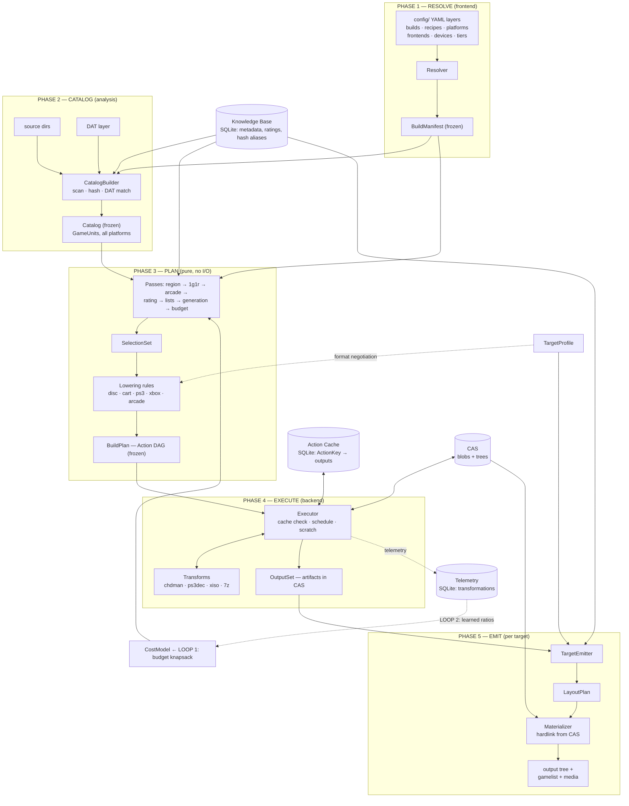

# 01 — Architecture Blueprint: ROM Farmer as a Content-Addressed Build Compiler

**Status:** Agreed 2026-07-03. This is the target architecture for the refactor.
**Companion docs:** [02-ir-contracts.md](02-ir-contracts.md) (data contracts),
[03-migration-roadmap.md](03-migration-roadmap.md) (how to get there).

---

## Diagnosis

ROM Farmer is already ~80% of a Bazel/Nix-family build system — content-addressed
store, transformation cache, deterministic external tools, declarative config —
and every pain point in the architectural briefing (god-object context,
filesystem-as-state, scattered quirks, dual cache keys, split budget logic) is a
symptom of one missing piece: **a typed Intermediate Representation with hard
phase boundaries**. Stop thinking "pipeline of stages that mutate a shared
context" and start thinking "compiler that lowers a declarative program into a
content-addressed action graph."

The deepest reframe: **the CAS is the compiler's object store, SQLite is its
symbol table + action cache, the YAML is the source language, and a "build" is
just compiling that program for one or more targets.** Everything else follows
from taking that framing literally.

---

## 1. The Core Abstraction: A Five-Phase Compiler over an Action DAG

Not a "DAG of stages." The DAG is the **plan data structure**, not the code
topology. The code is five sequential phases, each with exactly one input type
and one output type — all serializable, frozen, and inspectable:

| Phase | Compiler analogue | Input → Output | Touches disk? | Touches DB? |
|---|---|---|---|---|
| **1. RESOLVE** | Parse + semantic analysis | YAML configs → `BuildManifest` (frozen) | read config | no |
| **2. CATALOG** | Symbol table construction | `BuildManifest` + source dirs + DATs → `Catalog` (frozen) | read-only scan/hash | read (KnowledgeBase) |
| **3. PLAN** | Middle-end passes + lowering | `Catalog` → `SelectionSet` → `BuildPlan` (Action DAG) | **no** | read-only |
| **4. EXECUTE** | Backend / codegen | `BuildPlan` → `OutputSet` (artifacts in CAS) | scratch + CAS only | Action Cache + Telemetry |
| **5. EMIT** | Linker / object emission | `OutputSet` + `TargetProfile` → materialized output tree | output tree only | read (KnowledgeBase) |

Rules that make this work:

- **Phase boundaries are typed contracts.** A phase cannot return the wrong type
  (the `ApplyPS3UpdatesStage` returns-`StageResult` bug becomes impossible by
  construction). `StageContext` is deleted — there is no shared mutable bag.
- **Phases 1–3 are pure.** No symlinks, no work_dir, no soft-deletes. The plan is
  data. Only the Executor and the Materializer touch the filesystem. This kills
  briefing §3.7 outright.
- **Every inter-phase artifact is serializable.** This buys `romfarmer plan
  --explain` (per-pass diff: "Chrono Cross removed by generation-dedup, kept on
  psx"), `--dry-run`, plan diffing between builds, and **free resumability** —
  `BuildState` YAML dies, because resume = re-derive the deterministic plan and
  let the action cache skip completed work. Incremental by construction, like
  Bazel.

### 1.1 The IR: two layers

**Logical layer — what selection reasons about:**

- `GameUnit` — canonical game: disc set (multi-disc atomicity is structural, not
  regex-at-selection-time), region/language, rating, tier, generation
  membership, platform. Built once in CATALOG, never rebuilt.
- `Catalog` — immutable snapshot of `GameUnit`s across **all platforms in the
  build**. Passes produce new snapshots.

**Physical layer — what execution reasons about:**

- `Identity` — **the fix for briefing §3.9.** One identity record per artifact:
  `sha256` (primary key) + alias hashes (`md5`, zip-central-directory identity)
  + provenance. All aliases recorded **atomically by one writer (the Executor)**
  when an artifact is first materialized or first hashed. Cache lookup tries any
  alias; there is no longer a "MD5 row vs CRC32 row written by different stages
  at different times."
- `Artifact` — content-addressed file **or tree** (unifying `ContentStore` and
  `TreeStore` under one reference type), with state
  `PLANNED | CACHED | MATERIALIZED`.
- `Action` — a pure description: `(tool, tool_version, params,
  inputs: [ArtifactRef]) → outputs: [ArtifactRef]`. `ActionKey = hash(normalized
  action)`. This *is* the action-cache key — the current
  `(source_md5, format, params_hash)` scheme generalized and made uniform.
- `BuildPlan` — the DAG of Actions. Shared subgraphs between targets dedupe
  automatically by `ActionKey`: "build once, link everywhere" stops being a
  convention and becomes a structural property.

### 1.2 Collapsing 21 stages into 4 engine concepts

The single biggest simplification: **caching is not a pipeline step, it is a
property of the execution engine.** `CachePreCheckStage`, `CacheStoreStage`, and
`CASIngestStage` are cross-cutting concerns masquerading as stages. In the
compiler model, the Executor checks the action cache before *every* action and
stores after *every* action, uniformly. Three stages deleted, §3.9 fixed, and no
transform ever thinks about caching again.

| Old stage(s) | New home | Concept |
|---|---|---|
| `PreFilterStage`, `Filter1G1RStage`, `FilterArcadeStage`, `FilterRatingStage`, `SelectionFilter`, `FilterGenerationStage`, `ApplyListsStage` | `planner/passes/` | **Pass** — pure `(Catalog, BuildManifest, CostModel) → Catalog` |
| `FilterDATStage` | split: hashing/identity → `analysis/CatalogBuilder`; DAT dedup → a Pass | Catalog construction vs. selection are different jobs |
| `ExtractArchiveStage`, `ExtractPS3Stage`, `UnzipRVZStage`, `UnzipWUXStage`, `TransformPS3Stage`, `ConvertXISOStage`, `CompressCHDStage`, `CompressArchiveStage`, `CompressSquashFSStage` | `engine/transforms/` | **Transform** — dumb, cache-unaware tool adapter: `(inputs, params, scratch) → outputs` |
| `CachePreCheckStage`, `CacheStoreStage`, `CASIngestStage` | **deleted** | Executor infrastructure |
| `CreateM3UStage` | lowering | M3U is a **derived artifact declared in the plan** — disc groups are known at catalog time, so the M3U is just another (trivially cheap) Action output |
| `OrganizeStage`, `GenerateMetadataStage`, `EmitExtrasStage`, `CopyArcadeStage` | `targets/emitters/` | **Emitter** (see §2) |
| `ApplyPS3UpdatesStage` | lowering + emit | PSN update fetch is an **acquisition Action** (network fetch → artifact, cacheable like anything else); placement of PKGs is emission |

### 1.3 Lowering rules as data (fixes briefing §3.2)

Platform quirks move into per-platform lowering modules
(`planner/lowering/ps3.py`, `xbox.py`, `disc.py`, …) that answer one question:
*given a `GameUnit` and a negotiated `FormatChain`, emit the Action chain.*
Consequences:

- The Xbox two-step (`XISO → SquashFS`) becomes an explicit
  `FormatChain = [xiso, squashfs]` in the resolved manifest — the resolver models
  it honestly instead of `_xiso_stages()` hardcoding it.
- PS3's output format (`folder | iso | iso.gz`) becomes a lowering parameter
  sourced from the manifest — the hardcoded `target_format = "folder"`
  disappears, and `ps3_utils.py` moves to a `platforms/ps3/` domain module where
  PSN clients belong.
- Adding a platform = adding a lowering rule + maybe a Transform. No orchestrator
  or builder edits.

A subtle but important win: **cross-platform generation dedup (1G1Gen) is
currently a cross-platform concern trapped inside a per-platform pipeline
architecture.** In the new model, Passes naturally operate on the whole-build
`Catalog` (all platforms at once); only lowering and execution are per-unit. The
awkwardness evaporates.

### 1.4 The optimization loops, formalized

Two loops, one service:

- **Loop 1 (within-build): budget knapsack.** The `SelectionPass` consults a
  single `CostModel` service to predict output sizes. This is where
  `RATING_BUDGET` lives — as a pure pass over the Catalog, not a stage that
  deletes symlinks.
- **Loop 2 (across-build): ratio learning.** The Executor emits telemetry
  (`ROMTransformation` rows) after every action; `CostModel` computes posteriors
  from telemetry, falling back to priors from `size_data.json`. **One table of
  truth, keyed by a platform enum** — fixing §3.3's two out-of-sync ratio tables
  and the silent `"sega-cd"` string-mismatch fallthrough.

---

## 2. Target Isolation: Profile / Negotiation / Emitter

The briefing's own data proves the seam: Batocera, RocknIX, and Everdrive share
identical PLAN+EXECUTE behavior and differ only in FINALIZE plus *constraints
fed backwards into planning* (compression preference, platform support). So a
Target is not one object — it's **two objects and one protocol between them and
the planner**:

### 2.1 `TargetProfile` — declarative constraints (data, from YAML, consumed at PLAN time)

The planner never branches on target identity; it queries the profile.
Everything the core needs to know about a target is expressible as data:
platform support gates, format preference order, naming/folder mapping, layout
constraints (max files/dir, filename charset/length for FAT32/Everdrive),
metadata dialect, media policy. Full protocol in
[02-ir-contracts.md](02-ir-contracts.md).

### 2.2 Format negotiation — the planner-side handshake

During PLAN, for each `(platform, target)` pair: intersect the recipe's
requested `FormatChain`s with `profile.format_preferences()`, take the first
mutually supported chain, and hand it to the lowering rule. This formalizes
today's informal "compression fallback rules" in `FrontendConfig` and is the
**only** point where target constraints influence the action graph.

### 2.3 `TargetEmitter` — behavior (plugin, consumed at EMIT time)

Three responsibilities: `plan_layout` (pure — returns the desired tree as data),
`emit_metadata` (gamelist.xml + media declarations), `post_process` (jdupes,
rsync, install scripts).

Critical design point: **even the emitter mostly produces a plan.**
`plan_layout` returns data; one generic **Materializer** (the hardlink-from-CAS
engine, today's `_link_or_copy` logic, written once) executes every
`LayoutPlan`. Metadata discovery reads the `LayoutPlan` — never `rglob` over the
output directory — killing §3.8's 40-extension hardcoded glob list and §3.1's
filesystem-coupled metadata scan. Extensions per platform already live in
`FrontendConfig`; the emitter consults the profile.

### 2.4 Proof by Everdrive

The nastiest target should cost zero core code:

| Everdrive quirk | Where it lands |
|---|---|
| No compression (real hardware) | `format_preferences → [[none]]` — negotiation picks raw ROM; lowering emits extract-only chains |
| ≤ 50 files/dir, flat | `layout_constraints.max_files_per_dir = 50` — the *generic* balanced-split algorithm in the default emitter reads it |
| No metadata | `metadata_dialect = NONE` — `emit_metadata` returns `[]` |
| FAT32 filename limits | `layout_constraints` filename rules — applied by the generic layout planner |

Everdrive = one YAML profile + the default emitter. Batocera = profile +
`ESGamelistEmitter`. A future weird target (MiSTer, Anbernic stock OS) = profile
+ at most a small emitter subclass.

---

## 3. System Blueprint

### 3.1 Dataflow



### 3.2 Module layout

```
romfarmer/
├── cli/                      # thin verbs mapped to phases:
│                             #   plan / plan --explain / build / emit / cache / cas
│
├── frontend/                 # ◀── CONFIG LAYERS — the ONLY code that reads YAML.
│   ├── schema/               #   BuildSpec, RecipeSpec, SlimPlatform, TargetProfile models
│   └── resolver.py           #   → BuildManifest (frozen). After this, nothing reads config.
│
├── ir/                       # ◀── THE CONTRACTS. Zero I/O, zero deps. Everything imports ir/;
│   ├── identity.py           #   ir/ imports nothing.
│   ├── catalog.py            #   GameUnit, Catalog
│   ├── actions.py            #   Action, ActionKey, Artifact, BuildPlan
│   └── layout.py             #   OutputSet, LayoutPlan, LayoutConstraints
│
├── analysis/                 # Phase 2
│   ├── scanner.py, dat/      #   catalog construction; DAT semantic layer (parsers move here)
│   └── knowledge.py          #   KnowledgeBase — the ONLY read facade over metadata SQLite
│
├── planner/                  # Phase 3 (pure)
│   ├── passes/               #   one file per pass, common Pass protocol
│   ├── costmodel.py          # ◀── OPTIMIZATION LOOP 1 (priors: size_data.json; posteriors: telemetry)
│   └── lowering/             #   per-platform rules; platform quirk modules (ps3/, xbox/) live behind these
│
├── engine/                   # Phase 4
│   ├── executor.py           #   DAG walk, uniform action-cache check/store, scratch lifecycle
│   ├── transforms/           #   dumb tool adapters (cache-unaware, context-unaware)
│   ├── cas/                  # ◀── CAS: blob store + tree store, unified behind ArtifactRef
│   └── actioncache.py        # ◀── SQLite facade: ActionKey → output artifacts (sole writer: executor)
│
├── targets/                  # Phase 5
│   ├── profiles/             #   batocera, rocknix, everdrive… (mostly YAML + loader)
│   └── emitters/             #   generic materializer + gamelist emitter + extras
│
├── telemetry/                # ◀── OPTIMIZATION LOOP 2: transformation history → CostModel
│
└── db/                       # ◀── SQLite: one file, three logical schemas with three facades:
                              #   knowledge (read-mostly) / action-cache (executor-only) / telemetry (append-only)
```

**Dependency rule (enforce with import-linter):** `frontend | analysis | planner
| engine | targets` all depend on `ir/` and never on each other, except each
phase may consume the previous phase's output type. SQLite is reachable only
through the three facades — no more raw queries scattered across stages
(briefing §3.5's `getattr` defensive-access pattern has nothing left to defend
against, because there is no context object).

### 3.3 What this structurally eliminates

| Briefing pain point | Structural fix |
|---|---|
| 3.1 `StageContext` god object, dual schemas | Deleted. Typed phase I/O; no shared mutable bag |
| 3.2 PS3/Xbox/arcade leaks | Lowering rules + platform domain modules; FormatChain models multi-step compression |
| 3.3 Two ratio tables, string-match fallthrough | Single `CostModel`, platform enum, prior+posterior |
| 3.4 Budget logic in two orchestrators | One planner; legacy orchestrator deleted at end of migration |
| 3.5 Defensive `getattr` config access | One frozen `BuildManifest`; no second config era |
| 3.6 `organized_files_metadata` shadow dict | Typed subdirectory groups in `LayoutPlan` |
| 3.7 Symlinks as filter state | Plan is pure data; filesystem touched only in EXECUTE/EMIT |
| 3.8 Hardcoded 40-extension glob | Metadata reads `LayoutPlan`, never rescans disk |
| 3.9 MD5/CRC32 cache-key divergence | Unified `Identity` with aliases; single atomic writer (Executor) |

### 3.4 Multi-target builds, for free

The compiler model gives fan-out structurally: one Catalog + one planning run
can serve N targets. Format negotiation may produce different action subgraphs
per target, but shared actions dedupe by `ActionKey` — a CHD built for Batocera
is a cache hit when RocknIX asks for it, and Everdrive's uncompressed chain
shares the extraction actions. "Build once, link everywhere" becomes a property
of the graph rather than a discipline.
