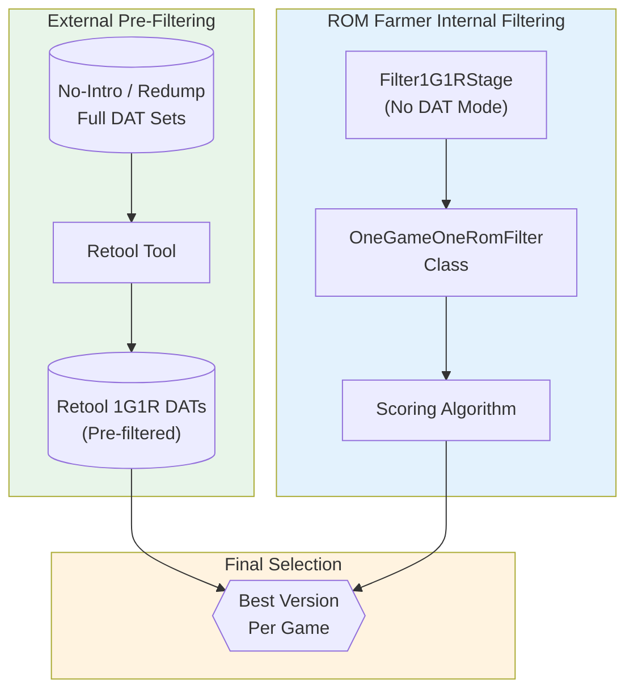
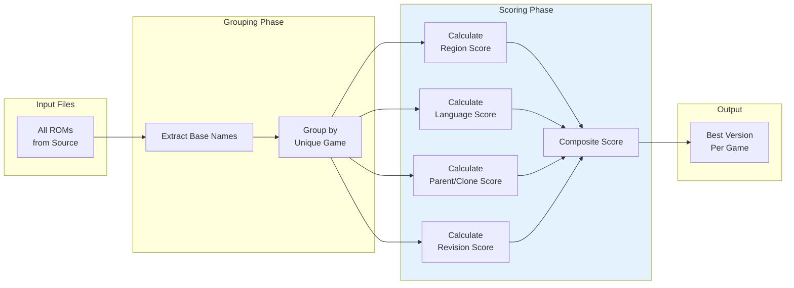
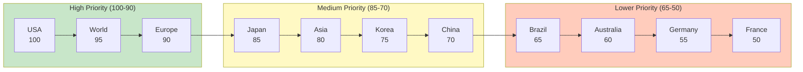
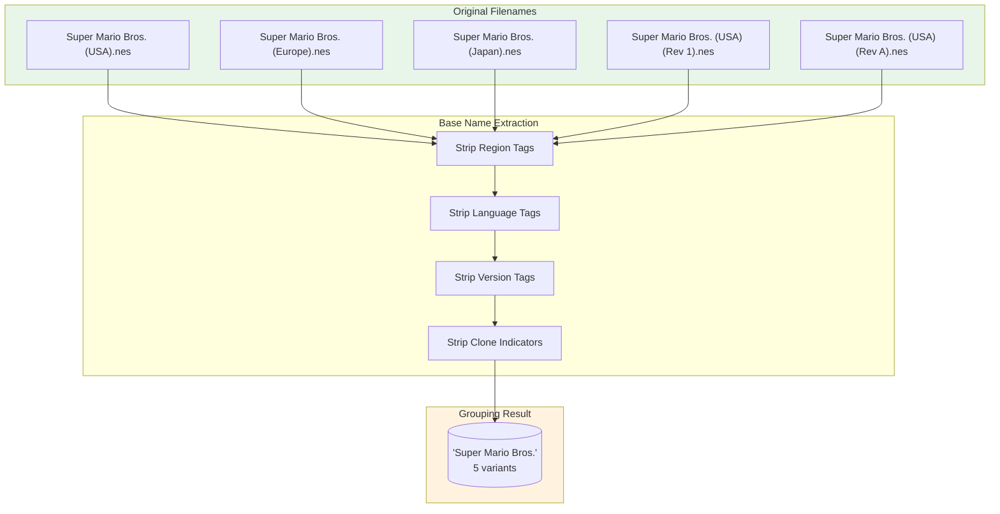
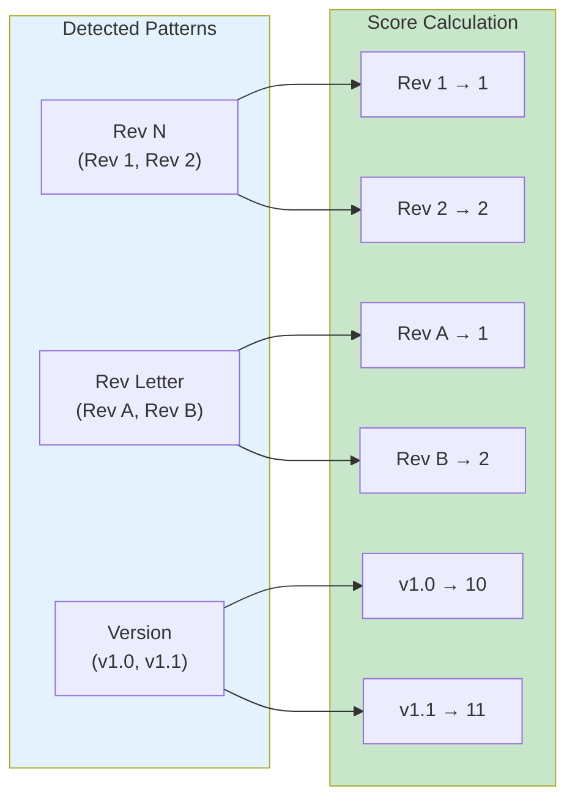
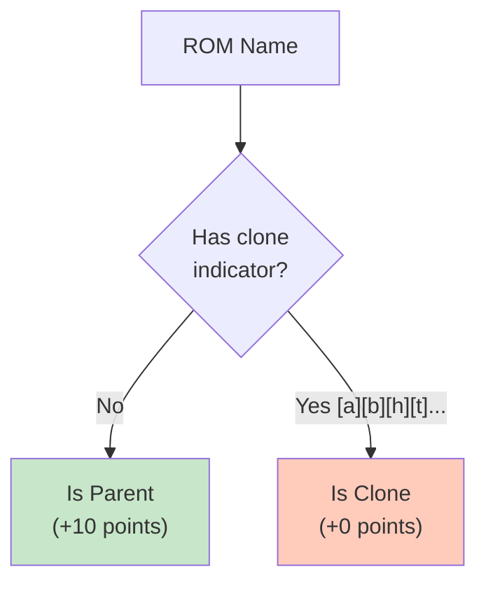
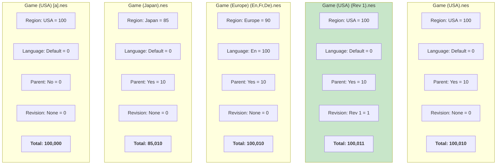
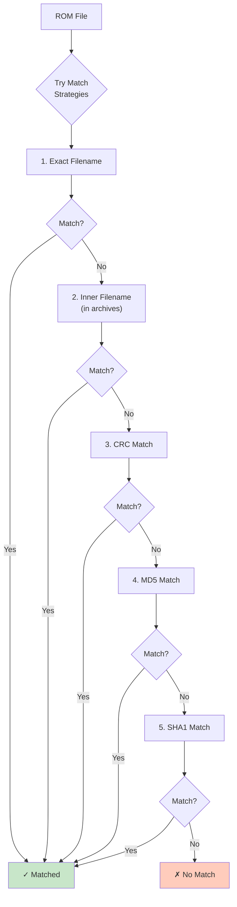
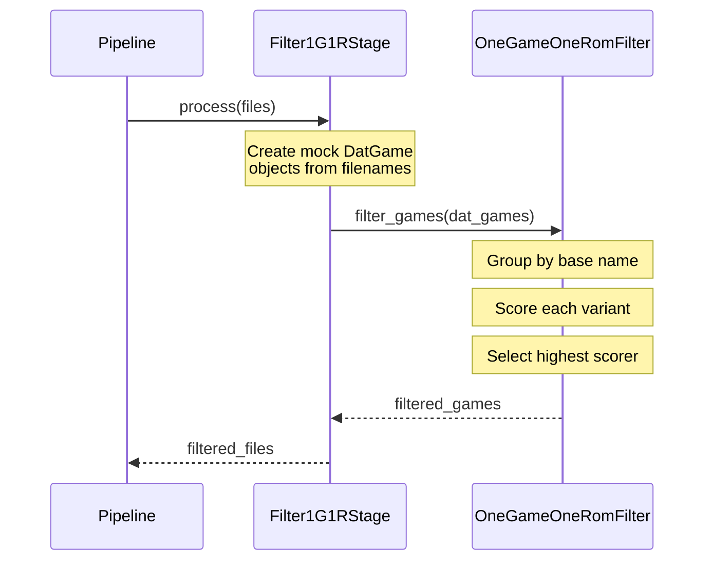
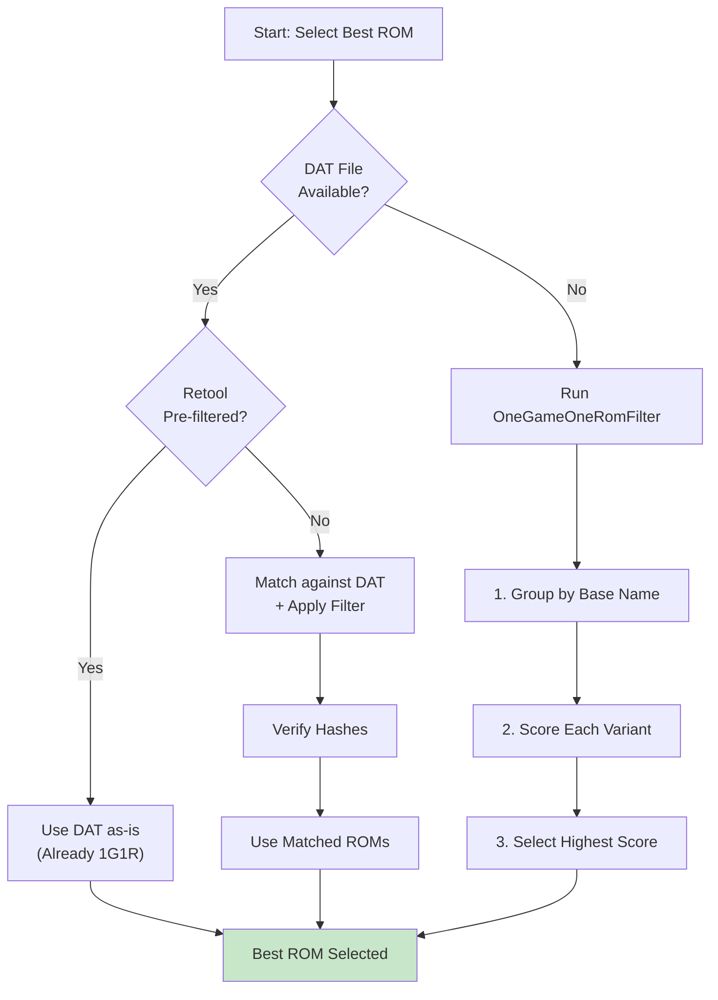

# ROM Farmer 1G1R Filtering System

## Executive Summary

The **1G1R (One Game, One ROM)** philosophy ensures that only the best version of each game is retained, eliminating duplicates, inferior revisions, and regional variants. ROM Farmer implements this through a sophisticated multi-layered approach combining external DAT filtering tools and internal scoring algorithms.

---

## System Architecture Overview



---

## Two Approaches to 1G1R

ROM Farmer supports two fundamentally different approaches to achieving 1G1R filtering:

### Approach 1: Pre-Filtered Retool DATs (Recommended)

The **preferred method** uses externally pre-filtered DAT files created by the [Retool](https://github.com/unexpectedpanda/retool) tool.

#### What is Retool?

Retool is a specialized tool that processes standard No-Intro and Redump DAT files to:
- Apply 1G1R filtering with configurable region/language preferences
- Remove bad dumps, prototypes, and unwanted categories
- Maintain parent-clone relationships
- Generate optimized DAT files for ROM verification

#### Available DAT Sources

| DAT Source | Description | Pre-filtering Applied |
|------------|-------------|----------------------|
| `RETOOL_1G1R_ENG` | No-Intro with English preference | ✅ 1G1R + Language |
| `RETOOL_1G1R_USA` | No-Intro with USA preference | ✅ 1G1R + Region |
| `RETOOL_1G1R_ALL` | No-Intro all languages | ✅ 1G1R only |
| `REDUMP_RETOOL_1G1R_ENG` | Redump with English preference | ✅ 1G1R + Language |
| `REDUMP_RETOOL_1G1R_USA` | Redump with USA preference | ✅ 1G1R + Region |
| `NOINTRO_STANDARD` | Unfiltered No-Intro | ❌ Full set |
| `REDUMP_STANDARD` | Unfiltered Redump | ❌ Full set |

#### Retool DAT Format

Retool DATs follow the Logiqx XML format with enhancements:

```xml
<game name="Super Mario Bros. (USA)">
    <category>Games</category>
    <description>Super Mario Bros. (USA)</description>
    <rom name="Super Mario Bros. (USA).nes" 
         size="40976" 
         crc="3337ec46" 
         md5="811b027eaf99c2def7b933c5208636de" 
         sha1="4612c5b84e5a2f4388f9e798c99d58c898b7c0b6"/>
</game>
```

Key features:
- **`<category>`** tags classify games (Games, Applications, Demos, etc.)
- Bad dumps and known problematic ROMs are excluded
- Only the best version per game is included
- Multiple hash types for verification (CRC, MD5, SHA1)

### Approach 2: Runtime 1G1R Filtering (Fallback)

When no DAT file is available (e.g., for platforms without official DATs), ROM Farmer applies its own 1G1R filtering at runtime using the `OneGameOneRomFilter` class.



---

## The Scoring Algorithm

### Score Composition

The 1G1R filter calculates a composite score for each ROM variant:

$$
\text{Score} = (\text{Region} \times 1000) + (\text{Language} \times 100) + (\text{Parent} \times 10) + (\text{Revision})
$$

This weighting ensures:
1. **Region** is the most important factor
2. **Language** breaks ties between same-region variants
3. **Parent** status prefers original releases over clones/alternates
4. **Revision** selects the latest version within identical criteria

### Region Priority System

Regions are prioritized based on typical collector preferences for English-speaking audiences:



#### Complete Region Priority Table

| Region | Score | Region | Score |
|--------|-------|--------|-------|
| USA | 100 | Taiwan | 45 |
| World | 95 | Netherlands | 40 |
| Europe | 90 | Scandinavia | 35 |
| Japan | 85 | Unknown | 30 |
| Asia | 80 | Proto | 20 |
| Korea | 75 | Unl (Unlicensed) | 10 |
| China | 70 | | |
| Brazil | 65 | | |
| Australia | 60 | | |
| Germany | 55 | | |
| France | 50 | | |

### Language Priority System

Language codes are extracted from ROM names and scored:

| Language | Score | Code Pattern |
|----------|-------|--------------|
| English | 100 | En |
| Japanese | 85 | Ja |
| French | 80 | Fr |
| German | 75 | De |
| Spanish | 70 | Es |
| Italian | 65 | It |
| Portuguese | 60 | Pt |
| Dutch | 55 | Nl |
| Swedish | 50 | Sv |
| Norwegian | 45 | No |
| Danish | 40 | Da |
| Finnish | 35 | Fi |
| Chinese | 30 | Zh |
| Korean | 25 | Ko |
| Russian | 20 | Ru |

### Multi-Language Handling

ROMs with multiple languages (e.g., `"En,Fr,De"`) receive the **highest score** among their languages:

```python
# Example: "Super Mario Bros. (Europe) (En,Fr,De)"
# Languages found: En (100), Fr (80), De (75)
# Final language score: 100 (highest wins)
```

---

## Base Name Grouping

### How Games are Grouped

The filter groups ROMs by **base name** - the core game title stripped of all variant tags:



### Tag Patterns Removed

The base name extractor removes these pattern categories:

| Category | Examples | Regex Pattern |
|----------|----------|---------------|
| **Region** | (USA), (Europe), (Japan) | `\(USA\)`, `\(Europe\)`, etc. |
| **Language** | (En), (En,Fr,De), (Ja) | `\([A-Z][a-z](,[A-Z][a-z])*\)` |
| **Revision** | (Rev 1), (Rev A), (v1.1) | `\(Rev [0-9A-Z]+\)`, `\(v[0-9.]+\)` |
| **Clone Indicators** | [!], [a], [b], [h], [t] | `\[[!abhftpo]\]` |
| **Misc Tags** | (Proto), (Beta), (Demo) | `\(Proto\)`, `\(Beta\)`, etc. |

---

## Revision Detection

### Version Parsing

The filter parses revision/version information from ROM names:



### Revision Score Examples

| ROM Name | Parsed Revision | Score |
|----------|-----------------|-------|
| Super Mario Bros. (USA).nes | None | 0 |
| Super Mario Bros. (USA) (Rev 1).nes | Rev 1 | 1 |
| Super Mario Bros. (USA) (Rev 2).nes | Rev 2 | 2 |
| Zelda (USA) (Rev A).nes | Rev A | 1 |
| Zelda (USA) (Rev B).nes | Rev B | 2 |
| Sonic (USA) (v1.0).nes | v1.0 | 10 |
| Sonic (USA) (v1.1).nes | v1.1 | 11 |
| Sonic (USA) (v2.0).nes | v2.0 | 20 |

### Version Number Parsing

For semantic version strings like `v1.1`:
- Major version × 10 + Minor version
- `v1.0` = 10, `v1.1` = 11, `v2.0` = 20

---

## Parent vs Clone Detection

### Clone Indicators

The GoodTools naming convention uses bracketed codes to indicate ROM variants:

| Code | Meaning | Is Clone? |
|------|---------|-----------|
| `[!]` | Verified good dump | No |
| `[a]` | Alternate | Yes |
| `[b]` | Bad dump | Yes |
| `[c]` | Cracked | Yes |
| `[f]` | Fixed | Yes |
| `[h]` | Hack | Yes |
| `[o]` | Overdump | Yes |
| `[p]` | Pirate | Yes |
| `[t]` | Trained (cheats) | Yes |

### Parent Preference Logic



When `prefer_parents=True` (default), parent ROMs receive a 10-point bonus.

---

## Complete Scoring Example

Let's walk through scoring for a hypothetical game with multiple variants:

### Input Variants

| Variant | Region | Language | Parent | Revision |
|---------|--------|----------|--------|----------|
| Game (USA).nes | USA | - | Yes | None |
| Game (USA) (Rev 1).nes | USA | - | Yes | Rev 1 |
| Game (Europe) (En,Fr,De).nes | Europe | En,Fr,De | Yes | None |
| Game (Japan).nes | Japan | - | Yes | None |
| Game (USA) [a].nes | USA | - | No | None |

### Score Calculation



### Winner Selection

| Variant | Calculation | Final Score |
|---------|-------------|-------------|
| Game (USA).nes | 100×1000 + 0×100 + 10 + 0 | 100,010 |
| **Game (USA) (Rev 1).nes** | 100×1000 + 0×100 + 10 + 1 | **100,011** ✓ |
| Game (Europe) (En,Fr,De).nes | 90×1000 + 100×100 + 10 + 0 | 100,010 |
| Game (Japan).nes | 85×1000 + 0×100 + 10 + 0 | 85,010 |
| Game (USA) [a].nes | 100×1000 + 0×100 + 0 + 0 | 100,000 |

**Winner**: Game (USA) (Rev 1).nes - highest score due to revision bonus

---

## DAT Matching Strategies

When matching ROMs against DAT entries, multiple strategies are employed:



### Match Strategy Priority

1. **EXACT_FILENAME**: Direct filename comparison
2. **INNER_FILENAME**: Check filenames inside archives (ZIP, 7z)
3. **CRC_MATCH**: CRC32 hash comparison (fast)
4. **MD5_MATCH**: MD5 hash comparison
5. **SHA1_MATCH**: SHA1 hash comparison (most reliable)

---

## Integration in Build Pipeline

### Filter1G1RStage

When building without a DAT file, the `Filter1G1RStage` integrates 1G1R filtering:



### Configuration Options

```python
# In system config
class OneGameOneRomFilter:
    def __init__(
        self,
        region_priority: Dict[str, int] = DEFAULT_REGION_PRIORITY,
        language_priority: Dict[str, int] = DEFAULT_LANGUAGE_PRIORITY,
        prefer_parents: bool = True,        # Prefer non-clone ROMs
        prefer_later_revisions: bool = True # Prefer Rev 2 over Rev 1
    ):
```

---

## Summary: Decision Tree



---

## Key Takeaways

1. **Retool DATs are preferred** - Pre-filtering by Retool ensures consistent, well-tested 1G1R results

2. **Scoring is deterministic** - The weighted formula always produces consistent results

3. **Region trumps all** - USA ROMs are strongly preferred over other regions

4. **Later revisions win** - Bug fixes and improvements are automatically selected

5. **Parents over clones** - Original releases beat alternate dumps and hacks

6. **Multiple match strategies** - Hash-based matching catches renamed files

---

## Code References

| Component | File | Purpose |
|-----------|------|---------|
| `OneGameOneRomFilter` | `src/romfarmer/dat/filter.py` | Core 1G1R scoring algorithm |
| `Filter1G1RStage` | `src/romfarmer/stages/filter_1g1r.py` | Pipeline stage wrapper |
| `DATSource` | `src/romfarmer/config/models.py` | DAT source type enumeration |
| `RetoolDATParser` | `src/romfarmer/dat_parser/parser.py` | Parses Retool-enhanced DATs |
| `ROMMatcher` | `src/romfarmer/dat_parser/matcher.py` | Multi-strategy ROM matching |
| `DatGame` | `src/romfarmer/dat/__init__.py` | Game model with parent/clone |

---

*Generated for ROM Farmer v2.0*
