# ROM Farmer Build Orchestration System Analysis

*Generated: December 6, 2025*

## Executive Summary

ROM Farmer is a sophisticated build orchestration system designed for processing ROM collections at scale. It provides a flexible, configuration-driven architecture that separates platform-specific concerns from build orchestration logic, enabling:

- **Multi-platform processing** across 50+ gaming systems
- **Nested build orchestrations** for complex deployment scenarios
- **Deep configuration override system** for build-time customization
- **Resumable builds** with state persistence
- **Stage-based processing pipeline** with pluggable components

---

## Table of Contents

1. [Architecture Overview](#1-architecture-overview)
2. [Build Orchestration](#2-build-orchestration)
3. [Configuration System](#3-configuration-system)
4. [Override System](#4-override-system)
5. [Stage Pipeline](#5-stage-pipeline)
6. [CLI Interface](#6-cli-interface)
7. [Practical Examples](#7-practical-examples)

---

## 1. Architecture Overview

### High-Level Architecture

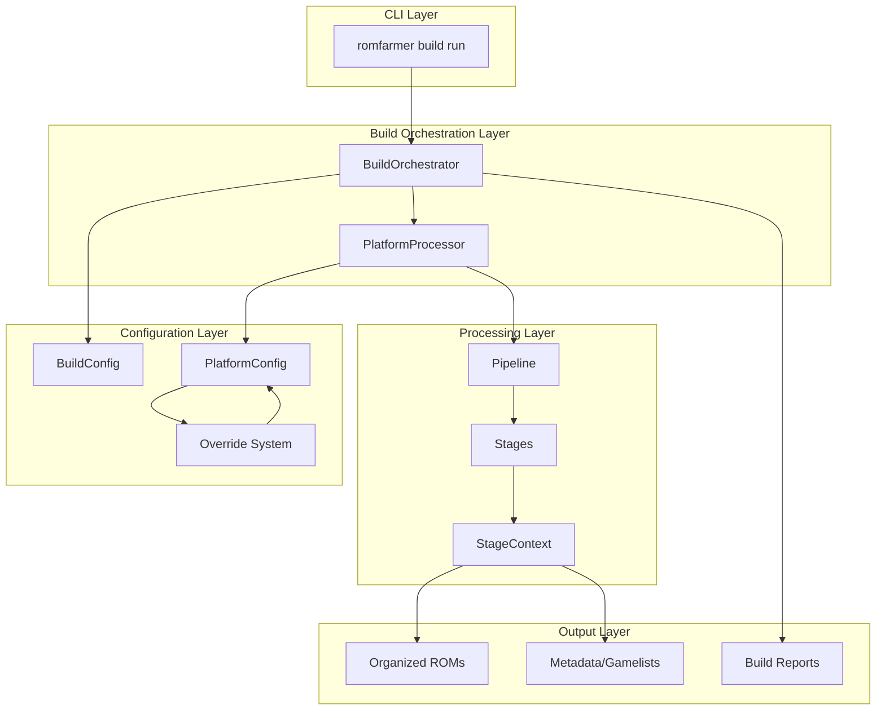

### Core Module Relationships

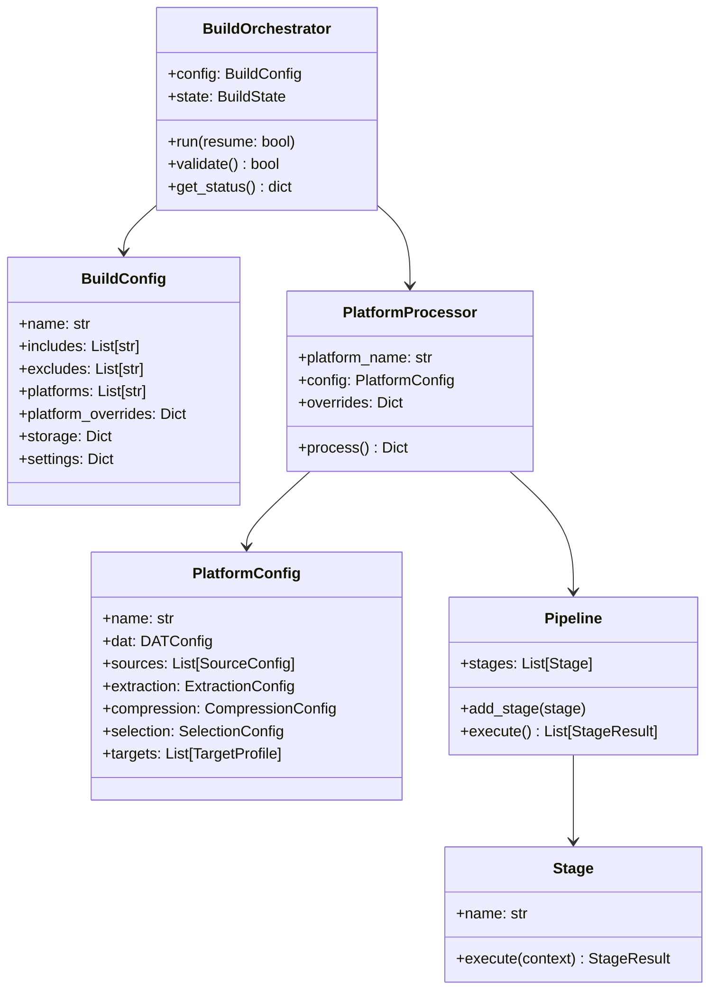

---

## 2. Build Orchestration

### BuildOrchestrator

The `BuildOrchestrator` is the central coordinator for multi-platform builds. It manages:

- Loading and validating build configurations
- Sequential platform processing with progress tracking
- State persistence for resume capability
- Error handling and recovery
- Post-build hooks (e.g., deduplication, deployment)

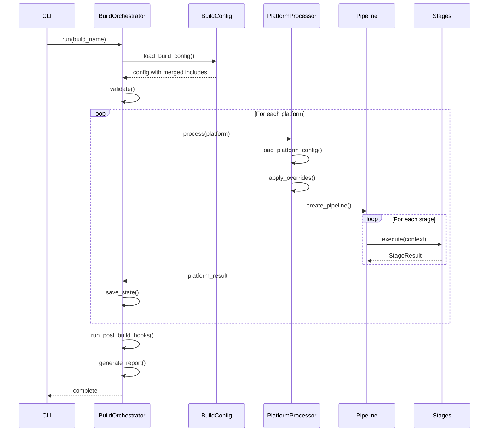

### Build State & Resume

ROM Farmer persists build state to enable resumable builds:

```yaml
# .build_state_{name}.yaml
build_name: "1tb-batocera-complete"
started_at: "2025-12-06T10:30:00"
completed_platforms:
  - nes
  - snes
  - gb
failed_platforms: []
current_platform: gbc
status: running
last_updated: "2025-12-06T11:45:32"
```

When `--resume` is passed, completed platforms are skipped automatically.

---

## 3. Configuration System

### Configuration Hierarchy

ROM Farmer uses a two-level configuration system:

```mermaid
flowchart TB
    subgraph BuildLevel["Build Level (config/builds/)"]
        BC[BuildConfig YAML]
        BC --> INC[includes: list]
        BC --> EXC[excludes: list]
        BC --> PLAT[platforms: list]
        BC --> PO[platform_overrides: dict]
        BC --> STOR[storage: dict]
        BC --> SET[settings: dict]
    end
    
    subgraph PlatformLevel["Platform Level (config/platforms/)"]
        PC[PlatformConfig YAML]
        PC --> DAT[dat: DATConfig]
        PC --> SRC[sources: List]
        PC --> EXT[extraction: ExtractionConfig]
        PC --> CMP[compression: CompressionConfig]
        PC --> SEL[selection: SelectionConfig]
        PC --> TGT[targets: List[TargetProfile]]
    end
    
    BC -.->|references| PC
    PO -.->|overrides| PC
```

### Nested Orchestration (includes)

Build configs can include other build configs, creating composable deployment profiles:

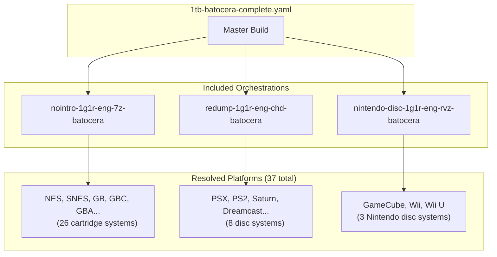

**Example Master Orchestration:**

```yaml
# 1tb-batocera-complete.yaml
name: 1tb-batocera-complete
description: "Complete 1TB Batocera build"

includes:
  - nointro-1g1r-eng-7z-batocera   # 26 cartridge platforms
  - redump-1g1r-eng-chd-batocera   # 8 disc platforms
  - nintendo-disc-1g1r-eng-rvz-batocera  # 3 platforms

excludes:
  - ps3  # Too large for 1TB

storage:
  temp_path: /path/to/...
  output_base: /path/to/...
```

### Key Configuration Models

#### BuildConfig

| Field | Type | Description |
|-------|------|-------------|
| `name` | str | Build identifier |
| `includes` | List[str] | Other build configs to merge |
| `excludes` | List[str] | Platforms to remove after merge |
| `platforms` | List[str] | Additional platforms (after includes) |
| `platform_overrides` | Dict | Per-platform overrides |
| `storage` | Dict | Paths for temp/output |
| `settings` | Dict | Execution settings |
| `post_build` | List | Commands to run after completion |
| `deploy` | Dict | Rsync deployment config |

#### PlatformConfig

| Field | Type | Description |
|-------|------|-------------|
| `name` | str | Platform identifier |
| `dat` | DATConfig | DAT file source/path |
| `sources` | List[SourceConfig] | Where to find ROMs |
| `extraction` | ExtractionConfig | How to extract archives |
| `compression` | CompressionConfig | Output compression format |
| `selection` | SelectionConfig | ROM selection/filtering |
| `targets` | List[TargetProfile] | Output targets (Batocera, RocknIX, etc.) |

---

## 4. Override System

The override system is one of ROM Farmer's most powerful features. It allows build configs to modify platform configs without duplicating them.

### Override Merge Semantics

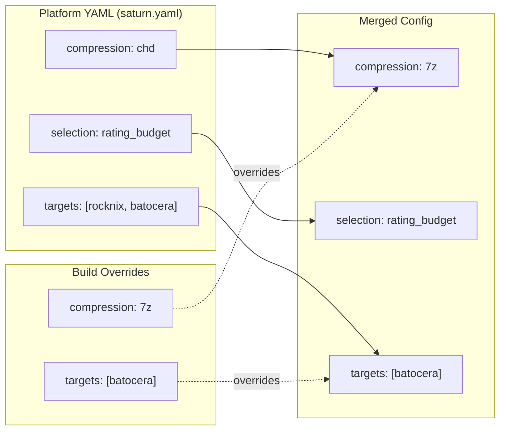

### Override Types

| Field Type | Merge Behavior |
|------------|----------------|
| Simple (enabled, name) | Direct replacement |
| Nested objects (dat, compression) | Deep merge (field-level) |
| Lists (targets, sources) | Replace or filter |
| None values | Explicitly disable/clear |

### YAML Anchor Patterns

ROM Farmer uses YAML anchors for DRY configuration:

```yaml
platform_overrides:
  nes: &standard_override
    targets:
      - name: batocera
        organization: flat
    compression:
      format: 7z
  
  snes: *standard_override
  gb: *standard_override
  gbc: *standard_override
  gba: *standard_override
  # ... applies same override to all
```

### Override Application Flow

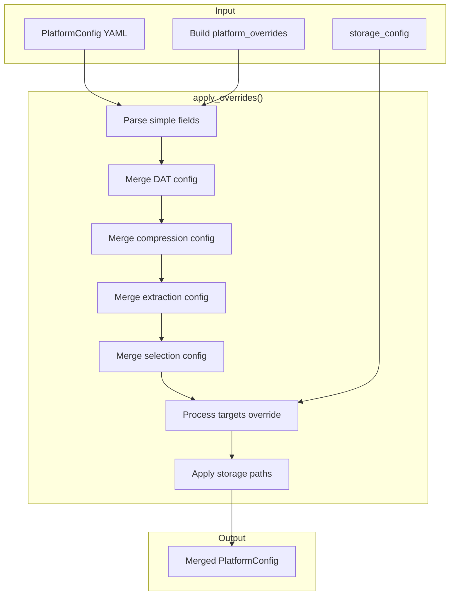

### Override Examples

**Example 1: Change compression format**
```yaml
platform_overrides:
  saturn:
    compression:
      format: 7z  # Override CHD to 7z
```

**Example 2: Filter to single target**
```yaml
platform_overrides:
  saturn:
    targets:
      - batocera  # Only output to Batocera, not RocknIX
```

**Example 3: Test mode with random sampling**
```yaml
platform_overrides:
  saturn:
    selection:
      strategy: random
      limit: 10
      seed: 42
```

**Example 4: Disable extraction (passthrough)**
```yaml
platform_overrides:
  saturn:
    extraction:
      enabled: false
    compression:
      format: none
```

---

## 5. Stage Pipeline

### Pipeline Architecture

The Pipeline orchestrates sequential stage execution with shared context:

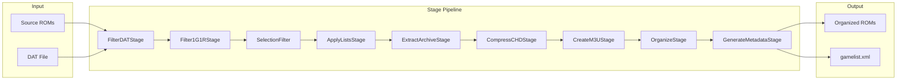

### Available Stages

| Stage | Purpose | When Used |
|-------|---------|-----------|
| `FilterDATStage` | Match files against DAT | Always |
| `Filter1G1RStage` | Apply 1G1R filtering | Always |
| `SelectionFilter` | Apply selection criteria | When `selection` configured |
| `ApplyListsStage` | Apply include/exclude lists | When `lists` configured |
| `ExtractArchiveStage` | Extract ZIP archives | Cartridge/Disc extraction |
| `ExtractPS3Stage` | Decrypt PS3 ISOs | PS3 extraction |
| `UnzipRVZStage` | Extract RVZ archives | Wii/GameCube |
| `ConvertXISOStage` | Convert to XISO format | Xbox/Xbox 360 |
| `CompressCHDStage` | Compress to CHD | Disc systems |
| `CompressArchiveStage` | Compress to 7z/ZIP | Cartridge systems |
| `CompressSquashfsStage` | Compress to Squashfs | Xbox (optional) |
| `CreateM3UStage` | Create M3U playlists | Multi-disc games |
| `OrganizeStage` | Organize output files | Always |
| `GenerateMetadataStage` | Create gamelist.xml | Always |

### Stage Context Flow

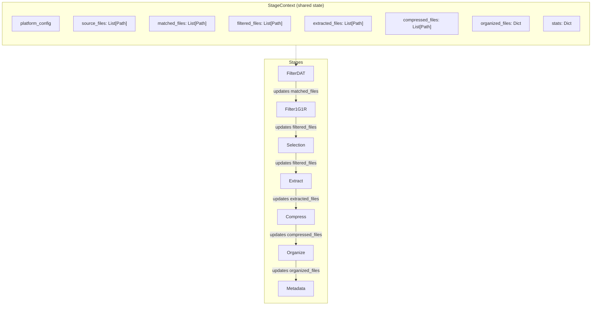

### Dynamic Stage Routing

The PlatformProcessor dynamically builds the pipeline based on configuration:

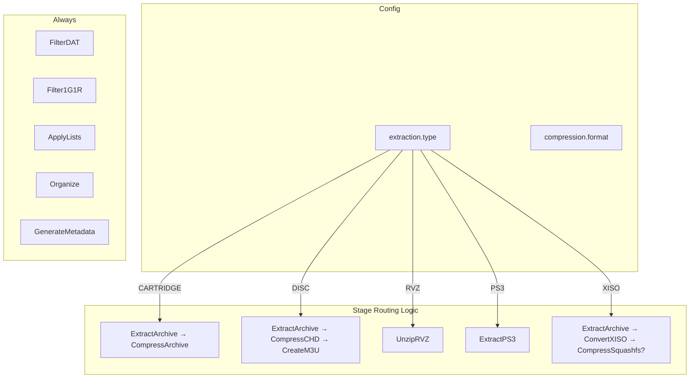

---

## 6. CLI Interface

### Build Commands

```bash
# Run a complete build
romfarmer build run 1tb-batocera-complete

# Run specific platforms only
romfarmer build run 1tb-batocera-complete --platforms saturn,dreamcast

# Resume interrupted build
romfarmer build run 1tb-batocera-complete --resume

# Validate without running
romfarmer build run 1tb-batocera-complete --validate-only

# Test mode: random sample
romfarmer build run 1tb-batocera-complete --test-sample 10 --seed 42

# Fast test: skip processing, copy originals
romfarmer build run 1tb-batocera-complete --test-sample 10 --passthrough

# Check build status
romfarmer build status 1tb-batocera-complete --verbose

# List available builds
romfarmer build list
```

### CLI Options Impact on Overrides

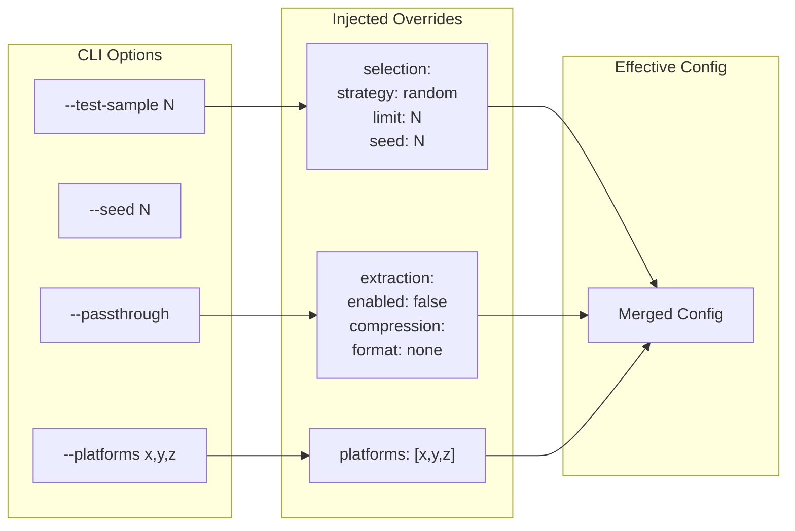

---

## 7. Practical Examples

### Example 1: Simple Cartridge Build

```yaml
# config/builds/nes-batocera.yaml
name: nes-batocera
platforms:
  - nes

platform_overrides:
  nes:
    targets:
      - name: batocera
        organization: flat
    compression:
      format: 7z
```

**What happens:**
1. Load `config/platforms/nes.yaml`
2. Apply overrides (7z compression, batocera target only)
3. Pipeline: FilterDAT → Filter1G1R → ApplyLists → Extract → Compress7z → Organize → Metadata

### Example 2: Disc System with Budget

```yaml
# config/builds/saturn-40gb.yaml
name: saturn-40gb
platforms:
  - saturn

platform_overrides:
  saturn:
    selection:
      strategy: rating_budget
      max_size_gb: 40.0
    targets:
      - name: batocera
```

**What happens:**
1. Load `config/platforms/saturn.yaml`
2. Apply selection filter (top-rated games fitting in 40GB)
3. Pipeline: FilterDAT → Filter1G1R → SelectionFilter → ApplyLists → Extract → CompressCHD → CreateM3U → Organize → Metadata

### Example 3: Nested Device Build

```yaml
# config/builds/512gb-portable.yaml
name: 512gb-portable
includes:
  - nointro-1g1r-eng-7z-batocera

excludes:
  - 3ds    # Too demanding
  - n64    # Controller issues
  - nds    # Touch screen

storage:
  output_base: /mnt/sdcard/roms
```

**What happens:**
1. Load `nointro-1g1r-eng-7z-batocera` (26 platforms)
2. Remove excluded platforms (3)
3. Process remaining 23 platforms with inherited settings

### Example 4: Full Production Build

```yaml
# config/builds/1tb-batocera-complete.yaml
name: 1tb-batocera-complete

includes:
  - nointro-1g1r-eng-7z-batocera
  - redump-1g1r-eng-chd-batocera
  - nintendo-disc-1g1r-eng-rvz-batocera

settings:
  parallel: false
  stop_on_error: false
  cleanup_temp: true

storage:
  temp_path: /path/to/...
  output_base: /path/to/...

post_build:
  - name: "Deduplicate with jdupes"
    command: "jdupes -r -L {output_base}"
    enabled: true

deploy:
  target: "batocera@192.168.1.100:/userdata/roms"
  rsync_options: "-avH --progress"
  delete_extra: false
```

**Build flow:**

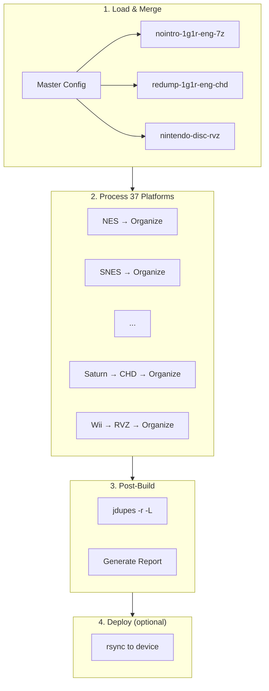

---

## Summary

ROM Farmer's build orchestration system provides:

| Capability | Implementation |
|------------|----------------|
| **Composability** | Nested includes with merge semantics |
| **Flexibility** | Deep override system at build/platform/target levels |
| **Reliability** | State persistence, resume, validation |
| **Extensibility** | Pluggable stage pipeline |
| **Efficiency** | Test modes, passthrough, parallel processing |
| **Automation** | Post-build hooks, deployment integration |

The separation of concerns between build orchestration, platform configuration, and processing stages enables ROM Farmer to scale from simple single-platform builds to complex multi-terabyte production deployments.
