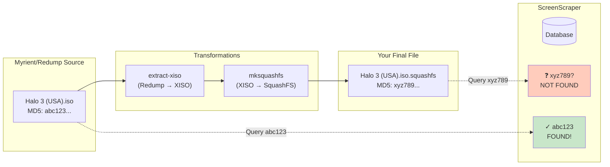
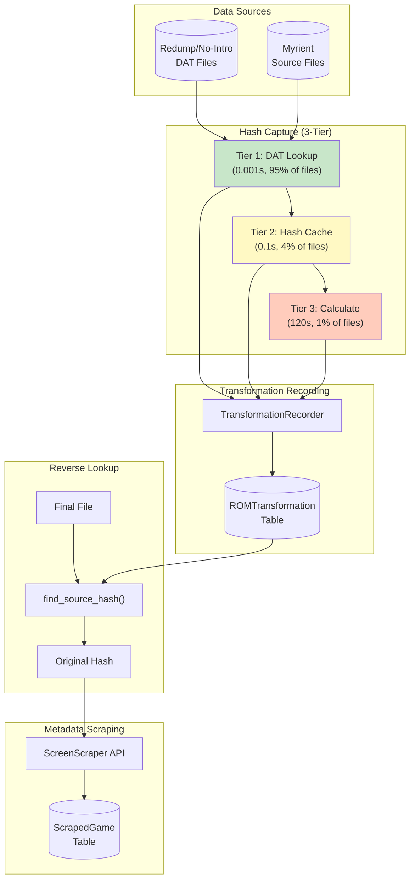
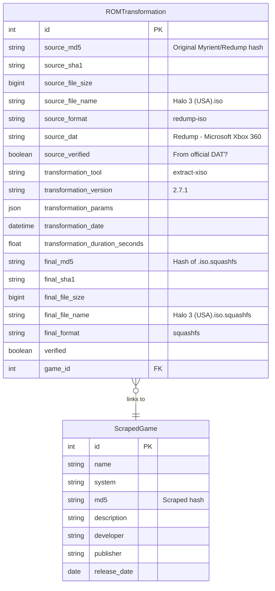
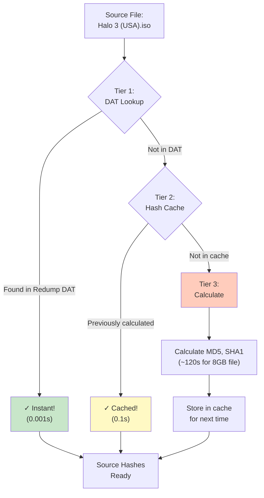
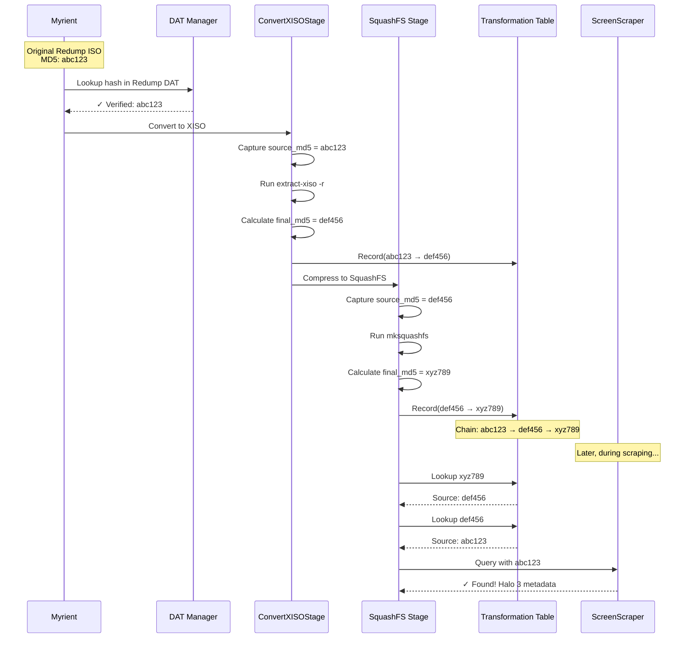
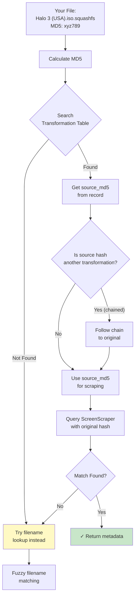
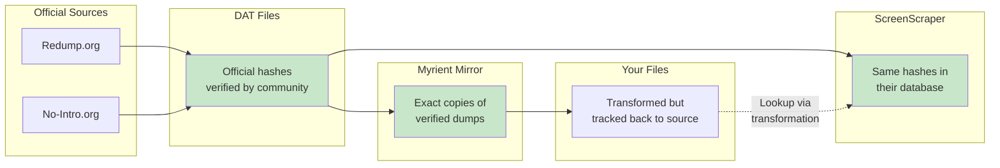
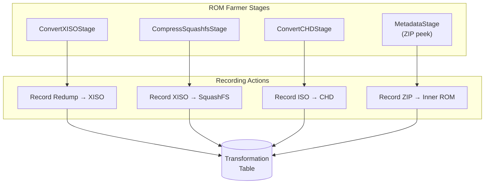
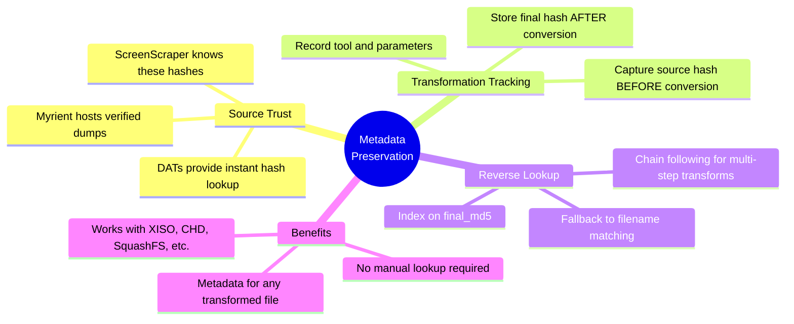

# ROM Farmer Metadata Preservation Through Transformations

## Executive Summary

ROM Farmer solves a critical problem in ROM management: **How do you get metadata for transformed files that don't exist in scraping databases?**

For example, when you convert a Myrient/Redump Xbox ISO to XISO format and then compress it to `.iso.squashfs`, the resulting file has completely different hashes than the original. ScreenScraper has never seen your `.iso.squashfs` file - but it *definitely* knows about the original Redump ISO that Myrient hosts.

ROM Farmer's **Transformation Tracking System** maintains the chain of custody from source to final file, enabling metadata lookup via the *original* known hashes.

---

## The Problem: Hash Mismatch



### Without Transformation Tracking

1. You have `Halo 3 (USA).iso.squashfs` (MD5: `xyz789...`)
2. You query ScreenScraper with `xyz789`
3. **Result**: No match found - ScreenScraper has never seen this file

### With Transformation Tracking

1. You have `Halo 3 (USA).iso.squashfs` (MD5: `xyz789...`)
2. ROM Farmer looks up `xyz789` in transformation table
3. Finds record: `xyz789` came from source `abc123`
4. Queries ScreenScraper with source hash `abc123`
5. **Result**: Match found! Full metadata returned

---

## System Architecture



---

## The Transformation Database Model

### ROMTransformation Table

The `ROMTransformation` table is the heart of the tracking system:



### Key Fields Explained

| Field | Purpose | Example |
|-------|---------|---------|
| `source_md5` | Hash of original Myrient file | `abc123def456...` |
| `source_file_name` | Original filename for reference | `Halo 3 (USA).iso` |
| `source_format` | Type of source file | `redump-iso` |
| `source_dat` | Which DAT verified this | `Redump - Microsoft Xbox 360` |
| `source_verified` | Was hash from official DAT? | `true` |
| `transformation_tool` | What transformed it | `extract-xiso` |
| `final_md5` | Hash of your actual file | `xyz789abc012...` |
| `final_format` | Final file type | `squashfs` |
| `game_id` | Link to scraped metadata | `42` |

---

## Hash Capture: The 3-Tier Strategy

Before recording a transformation, we need the source file's hashes. ROM Farmer uses a smart 3-tier strategy to avoid expensive calculations:



### Why This Matters for Myrient Files

Myrient hosts **verified Redump/No-Intro sets**. This means:

1. **95%+ of files have hashes in DAT files** - instant lookup
2. Source hashes are **pre-verified** against official DATs
3. ScreenScraper has these same hashes in their database
4. The chain of trust is maintained: `DAT → Myrient → Your File → Transformation → Scraper`

---

## Recording Transformations: XISO Example

Here's exactly how ROM Farmer records an Xbox transformation:

### Step 1: Capture Source Hash (BEFORE conversion)

```python
# In ConvertXISOStage._convert_to_xiso()

# Capture source hash BEFORE conversion for transformation tracking
source_md5 = None
source_size = None
if self.db_session:
    self._log_info(context, f"  Hashing source ISO: {iso_file.name}")
    source_md5 = self._calculate_md5(iso_file)
    source_size = iso_file.stat().st_size
    self._log_info(context, f"    Source MD5: {source_md5[:16]}...")
```

### Step 2: Perform Conversion

```python
# Run extract-xiso -r to convert in place
cmd = [
    str(self.extract_xiso_path),
    "-r",  # Rewrite mode (Redump → XISO)
    str(iso_file)
]
subprocess.run(cmd, ...)
```

### Step 3: Record Transformation (AFTER conversion)

```python
# In ConvertXISOStage._record_transformation()

# Calculate final XISO hash
final_md5 = self._calculate_md5(xiso_file)
final_size = xiso_file.stat().st_size

# Create transformation record
transformation = ROMTransformation(
    source_md5=source_md5,           # Original Myrient hash
    source_file_size=source_size,
    source_format='redump-iso',
    source_dat='Redump - Microsoft Xbox 360',
    
    final_md5=final_md5,             # XISO hash
    final_file_size=final_size,
    final_format='xiso',
    final_file_name=xiso_file.name,
    
    transformation_tool='extract-xiso',
    transformation_version='2.7.1',
    transformation_params={"format": "xiso", "mode": "rewrite"},
    
    game_id=game_id,  # Link to scraped game if found
)

session.add(transformation)
session.commit()
```

---

## Complete Xbox Workflow



---

## Reverse Lookup: From SquashFS to Metadata

### The Lookup Chain

When the metadata stage needs to scrape a file, it follows this process:



### Code: Metadata Lookup with Transformation Support

```python
# In MetadataStage._get_metadata_for_file()

# Calculate final file MD5
lookup_md5 = self._calculate_md5(file_path)

# Look up transformation to find original hash
transformation = session.query(ROMTransformation).filter(
    ROMTransformation.source_md5 == lookup_md5
).first()

if transformation:
    # We found a record linking this file to a source hash
    if transformation.game:
        # Game already linked - use it directly
        game = transformation.game
        lookup_method = "transformation-hash"
    elif transformation.final_md5:
        # Follow the chain to find the game
        game = session.query(ScrapedGame).filter(
            ScrapedGame.md5 == transformation.final_md5
        ).first()
        lookup_method = "transformation-link"
```

---

## Why Myrient + Transformation Tracking Works

### The Trust Chain



### Key Guarantees

| Guarantee | How It's Achieved |
|-----------|-------------------|
| **Source Authenticity** | DAT files verify Myrient files match official Redump/No-Intro hashes |
| **Transformation Integrity** | Source hash captured BEFORE any conversion |
| **Scraper Compatibility** | Original hashes exist in ScreenScraper database |
| **Chain of Custody** | Complete record: `Source → Tool → Final` |
| **Reverse Lookability** | Index on `final_md5` enables instant reverse lookup |

---

## Transformation Types Supported

### Currently Recorded

| Source Format | Tool | Final Format | Use Case |
|--------------|------|--------------|----------|
| Redump ISO | `extract-xiso` | XISO | Xbox/Xbox 360 conversion |
| XISO | `mksquashfs` | iso.squashfs | Batocera compression |
| Redump ISO | `chdman` | CHD | Saturn, PSX, etc. |
| ROM in ZIP | `rom-farmer-zip-peek` | Extracted | ZIP inner hash tracking |

### Transformation Recording Points



---

## Practical Example: Full Xbox Build

### Input
```
/data/emu/source/xbox360/Halo 3 (USA).zip
  └── Halo 3 (USA).iso  (Redump format, MD5: abc123def456...)
```

### Processing Steps

| Step | Input | Output | Recorded |
|------|-------|--------|----------|
| 1. Extract | `.zip` | `.iso` | ZIP → ISO hash mapping |
| 2. Convert | `.iso` (Redump) | `.iso` (XISO) | `abc123 → def456` |
| 3. Compress | `.iso` (XISO) | `.iso.squashfs` | `def456 → xyz789` |

### Final Output
```
/data/emu/output/xbox360/Halo 3 (USA).iso.squashfs
  MD5: xyz789abc012...
  
Transformation Records:
  abc123 → def456 (extract-xiso)
  def456 → xyz789 (mksquashfs)
```

### Metadata Lookup
```
1. File: Halo 3 (USA).iso.squashfs (MD5: xyz789)
2. Lookup xyz789 in transformations → Found: source=def456
3. Lookup def456 in transformations → Found: source=abc123
4. Query ScreenScraper with abc123
5. ✓ Match! Return full game metadata
```

---

## Summary: Key Takeaways



### The Bottom Line

1. **Myrient files are known** - Their hashes exist in official DATs and ScreenScraper
2. **We capture before transforming** - Source hash recorded before any conversion
3. **We track the chain** - Every transformation step is recorded with hashes
4. **We can reverse lookup** - Given any final file, we can find its original hash
5. **Scrapers work** - We query with the original hash that scrapers know

**Your `xiso.squashfs` file gets metadata because we tracked it back to the original Myrient ISO that ScreenScraper definitely knows about.**

---

## Code References

| Component | File | Purpose |
|-----------|------|---------|
| `ROMTransformation` | `src/romfarmer/metadata/transformation.py` | Database model for transformation records |
| `TransformationRecorder` | `src/romfarmer/metadata/transformation_recorder.py` | Context manager for recording transforms |
| `SmartHashCapture` | `src/romfarmer/metadata/hash_capture.py` | 3-tier hash capture strategy |
| `DATManager` | `src/romfarmer/metadata/dat_manager.py` | DAT file parsing and lookup |
| `ConvertXISOStage` | `src/romfarmer/stages/convert_xiso.py` | XISO conversion with recording |
| `MetadataStage` | `src/romfarmer/stages/metadata.py` | Scraping with transformation lookup |

---

*Generated for ROM Farmer v2.0*
