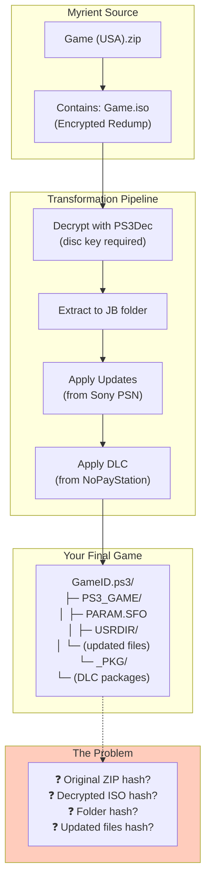
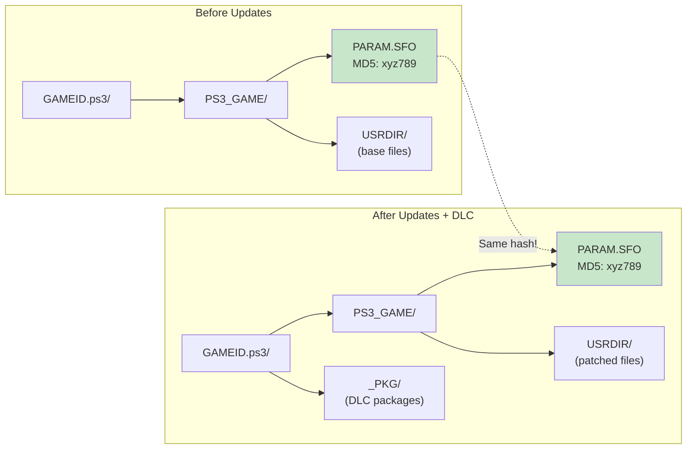
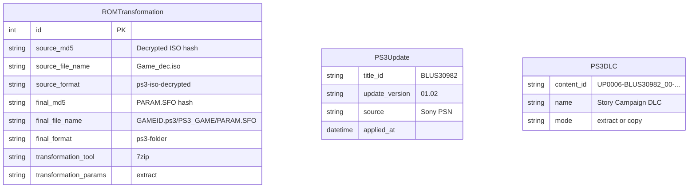
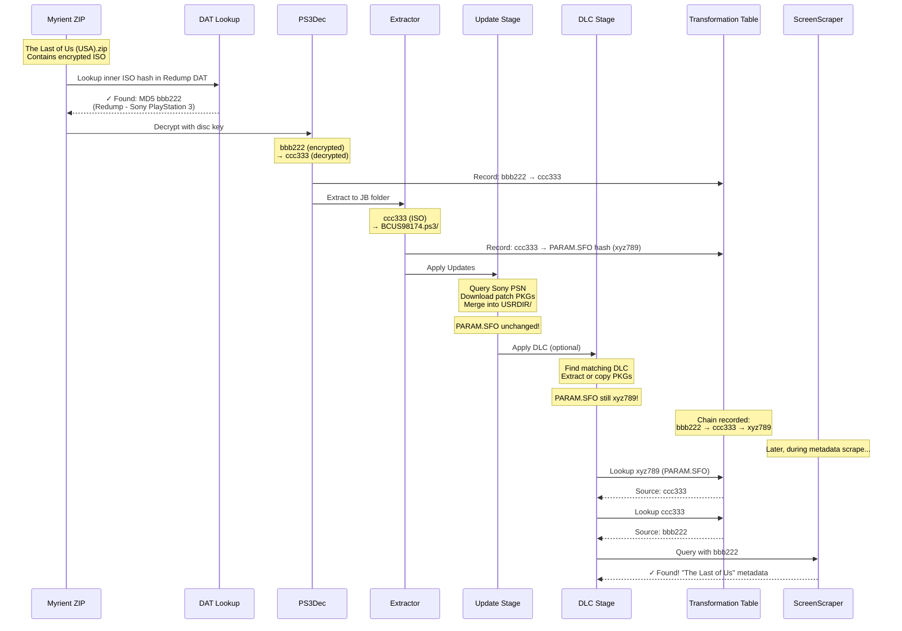
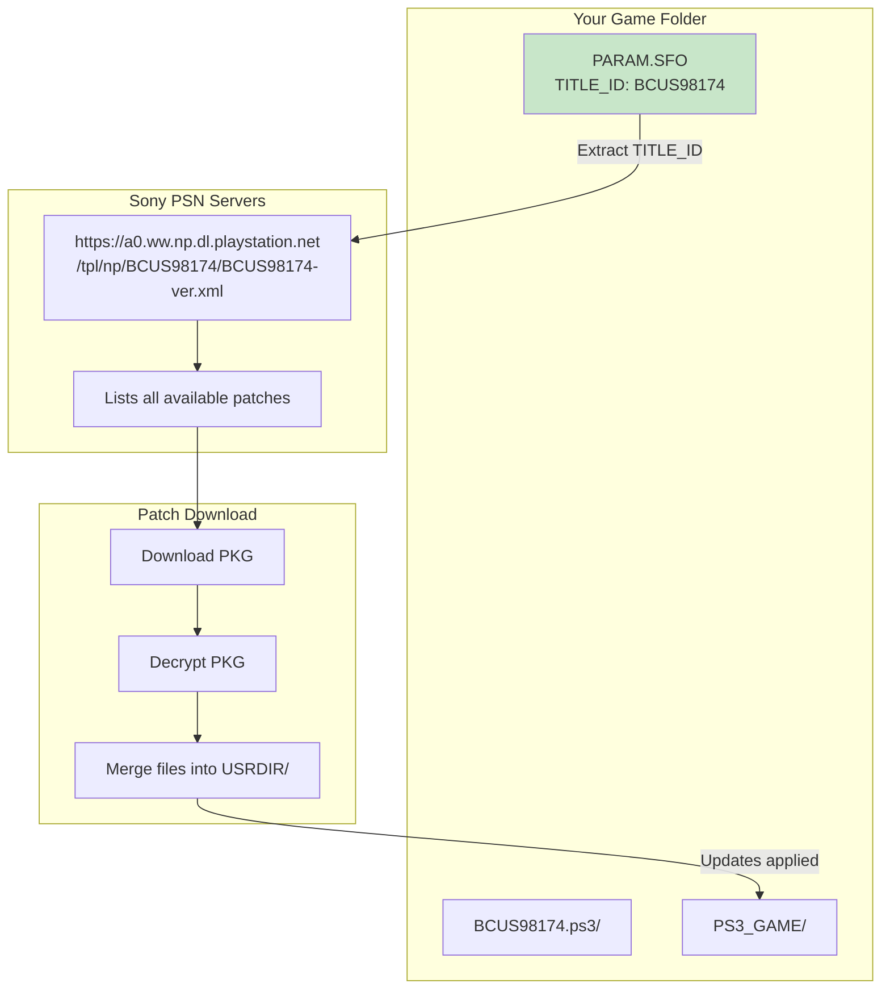
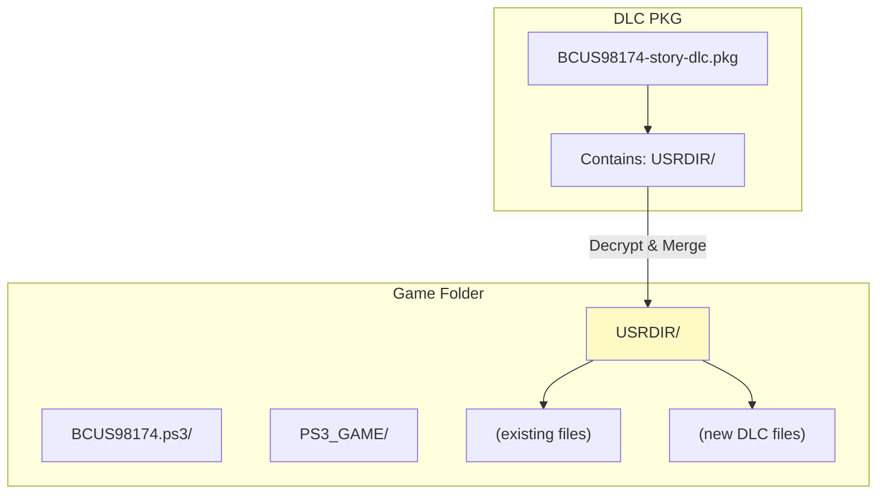
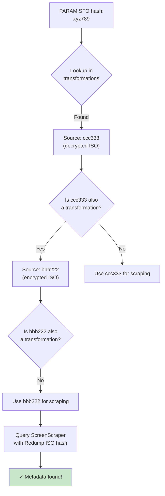
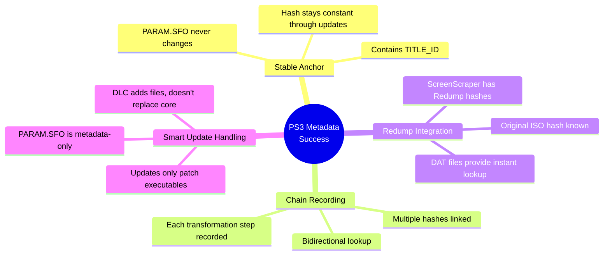

# ROM Farmer PS3 Metadata Preservation

## Executive Summary

PS3 presents the **most complex transformation challenge** in ROM Farmer. Unlike Xbox where we simply convert ISO → XISO → SquashFS, PS3 games undergo:

1. **Decryption** (encrypted ISO → decrypted ISO)
2. **Extraction** (ISO → JB folder structure)
3. **Updates** (patches downloaded from Sony PSN)
4. **DLC** (additional content merged or copied)

After all these transformations, the final game folder is **completely unrecognizable** from the original Myrient source. Yet ROM Farmer still achieves metadata lookup by tracking the chain back to the **original Redump ISO hash inside the Myrient ZIP**.

---

## The PS3 Challenge



### What Changes at Each Step

| Step | Input | Output | What Changes |
|------|-------|--------|--------------|
| **Unzip** | `Game.zip` | `Game.iso` | Outer container removed |
| **Decrypt** | `Game.iso` (encrypted) | `Game_dec.iso` (decrypted) | Encryption removed, hash changes |
| **Extract** | `Game_dec.iso` | `GAMEID.ps3/` folder | Format completely different |
| **Updates** | Base game folder | Patched folder | Files replaced/added |
| **DLC** | Game + PKGs | Game + content | New files merged |

---

## The Solution: PARAM.SFO as the Anchor

ROM Farmer uses a clever trick: the **PARAM.SFO file** remains constant through updates and serves as the **folder identifier**.



### The Transformation Chain

```
Myrient ZIP (MD5: aaa111)
    └── Encrypted ISO (MD5: bbb222) ← Redump hash, ScreenScraper knows this!
            └── Decrypted ISO (MD5: ccc333)
                    └── PS3_GAME/PARAM.SFO (MD5: xyz789)
                            ↓
                    [Updates Applied - files change]
                    [DLC Added - more files]
                            ↓
                    PS3_GAME/PARAM.SFO (MD5: xyz789) ← Still the same!
```

---

## Transformation Recording

### What Gets Recorded



### Code: Recording PS3 Folder Transformation

```python
def _record_folder_transformation(self, source_iso: Path, folder_path: Path):
    """Record PS3 folder transformation using PARAM.SFO as the link file."""
    
    # Hash the DECRYPTED source ISO (this came from Redump via Myrient)
    source_md5 = self._calculate_md5(source_iso)
    source_size = source_iso.stat().st_size
    
    # Hash PARAM.SFO as the "final" hash (folder identifier)
    # This remains constant even after updates/DLC!
    param_sfo = folder_path / "PS3_GAME" / "PARAM.SFO"
    final_md5 = self._calculate_md5(param_sfo)
    final_size = param_sfo.stat().st_size
    
    # Create transformation record
    transformation = ROMTransformation(
        # Source (decrypted ISO - we can look this up in Redump DAT!)
        source_md5=source_md5,
        source_file_size=source_size,
        source_file_name=source_iso.name,
        source_format='ps3-iso-decrypted',
        
        # Final (PARAM.SFO as folder identifier)
        final_md5=final_md5,
        final_file_size=final_size,
        final_file_name=f"{folder_path.name}/PS3_GAME/PARAM.SFO",
        final_format='ps3-folder',
        
        transformation_tool='7zip',
        transformation_params='{"format": "ps3-folder"}',
    )
    
    session.add(transformation)
    session.commit()
```

---

## The Complete PS3 Pipeline



---

## Updates: Sony PSN Integration

### How Updates Work

ROM Farmer queries **Sony's official update servers** to find and apply game patches:



### Update Response Example

```xml
<?xml version="1.0" encoding="UTF-8"?>
<titlepatch titleid="BCUS98174">
    <tag name="BCUS98174-patch">
        <package version="01.02" size="123456789" 
                 sha1sum="abc123..." 
                 url="http://b0.ww.np.dl.playstation.net/tppkg/.../BCUS98174_T12.pkg">
            <paramsfo>
                <TITLE>The Last of Us™</TITLE>
            </paramsfo>
        </package>
    </tag>
</titlepatch>
```

### Why Updates Don't Break Metadata

| File | Before Update | After Update |
|------|--------------|--------------|
| `PARAM.SFO` | MD5: xyz789 | MD5: xyz789 ✓ |
| `EBOOT.BIN` | Original | **Patched** |
| `USRDIR/*.sprx` | Original | **Patched** |
| New files | - | **Added** |

**PARAM.SFO is read-only** - it contains game metadata (title, ID, version) but isn't modified by updates. The hash stays constant!

---

## DLC: Two Modes

### Mode 1: COPY (for RPCS3/Emulators)

DLC PKG files are copied to a `_PKG/` subfolder for the emulator to install:

```
BCUS98174.ps3/
├── PS3_GAME/
│   └── (game files)
└── _PKG/
    ├── BCUS98174-dlc1.pkg
    ├── BCUS98174-dlc1.rap  (license key)
    ├── BCUS98174-dlc2.pkg
    └── BCUS98174-dlc2.rap
```

### Mode 2: EXTRACT (for Real PS3/ps3netsrv)

DLC is decrypted and merged directly into the game folder:



### DLC Sources

| Source | Type | RAP Required | Notes |
|--------|------|--------------|-------|
| **NoPayStation** | PKG Database | Yes (in TSV) | Largest PS3 DLC database |
| **Local Archive** | Downloaded PKGs | Varies | User's own collection |

---

## Metadata Lookup Flow

### Step 1: Identify Game Folder

```python
def _extract_title_id(self, game_folder: Path) -> Optional[str]:
    """Extract TITLE_ID from PARAM.SFO."""
    param_sfo = game_folder / 'PS3_GAME' / 'PARAM.SFO'
    
    # Parse SFO binary format
    # Find TITLE_ID entry (e.g., "BCUS98174")
    return title_id
```

### Step 2: Hash PARAM.SFO

```python
# PARAM.SFO hash is our folder identifier
param_sfo = folder_path / "PS3_GAME" / "PARAM.SFO"
folder_hash = calculate_md5(param_sfo)
```

### Step 3: Follow Transformation Chain



### Step 4: Query ScreenScraper

```python
# ScreenScraper knows the original Redump ISO hash
# Even though we have a patched folder with DLC!
result = screenscraper.query(
    md5=original_redump_iso_hash,  # bbb222
    system="ps3"
)
```

---

## Complete Example: The Last of Us

### Input

```
/path/to/source/myrient/ps3/The Last of Us (USA) (v1.00).zip
    └── The Last of Us (USA) (v1.00).iso  (encrypted, MD5: bbb222)
```

### Processing Steps

| Step | Action | Files | Hash |
|------|--------|-------|------|
| 1 | Unzip | Extract ISO from ZIP | - |
| 2 | Find key | Locate `The Last of Us (USA).dkey` | - |
| 3 | Decrypt | PS3Dec with disc key | ccc333 |
| 4 | Extract | 7zip to JB folder | - |
| 5 | Record | PARAM.SFO → xyz789 | xyz789 |
| 6 | Update | Sony PSN patch v1.11 | (files change) |
| 7 | DLC | Left Behind (optional) | (files added) |

### Transformation Records Created

```sql
-- Record 1: Encrypted → Decrypted (optional, if tracked)
INSERT INTO rom_transformations (source_md5, final_md5, tool)
VALUES ('bbb222', 'ccc333', 'PS3Dec');

-- Record 2: Decrypted ISO → Folder (via PARAM.SFO)
INSERT INTO rom_transformations (
    source_md5, source_format,
    final_md5, final_format, final_file_name
) VALUES (
    'ccc333', 'ps3-iso-decrypted',
    'xyz789', 'ps3-folder', 'BCUS98174.ps3/PS3_GAME/PARAM.SFO'
);
```

### Final Output

```
/path/to/output/ps3/The Last of Us (USA).ps3/
├── PS3_GAME/
│   ├── PARAM.SFO          ← MD5: xyz789 (unchanged!)
│   ├── ICON0.PNG
│   ├── PIC1.PNG
│   └── USRDIR/
│       ├── EBOOT.BIN      ← Patched to v1.11
│       ├── *.sprx         ← Patched
│       └── (game data)
└── _PKG/                   ← DLC (copy mode)
    ├── left-behind.pkg
    └── left-behind.rap
```

### Metadata Lookup

```
1. Your file: The Last of Us (USA).ps3/ (a folder!)
2. Hash PARAM.SFO: xyz789
3. Lookup xyz789 → Source: ccc333 (decrypted ISO)
4. Lookup ccc333 → Source: bbb222 (original Redump ISO)
5. Query ScreenScraper with bbb222
6. ✓ Result: "The Last of Us" - full metadata returned!
```

---

## Why This Works



### Key Insights

1. **PARAM.SFO is sacred** - Sony's design ensures this file contains metadata but isn't patched by updates

2. **Updates are additive** - Patches replace executables and add files, but don't touch the identification layer

3. **DLC is modular** - Whether copied (PKG mode) or extracted, DLC doesn't modify the base game identity

4. **Redump is the anchor** - The original encrypted ISO hash is what ScreenScraper knows, and we track back to it

---

## Summary: The PS3 Magic

| Challenge | Solution |
|-----------|----------|
| Game is decrypted | Record encrypted → decrypted transformation |
| Game is extracted to folder | Use PARAM.SFO hash as folder identifier |
| Updates change files | PARAM.SFO unchanged - use it as anchor |
| DLC adds content | Still same PARAM.SFO hash |
| Need metadata | Follow chain back to original Redump hash |

**Your PS3 game with updates and DLC still gets metadata because PARAM.SFO links back through the transformation chain to the original Redump ISO that ScreenScraper knows.**

---

## Code References

| Component | File | Purpose |
|-----------|------|---------|
| `TransformPS3Stage` | `src/romfarmer/stages/transform_ps3.py` | Full PS3 transformation pipeline |
| `ApplyPS3UpdatesStage` | `src/romfarmer/stages/apply_ps3_updates.py` | Update and DLC application |
| `SonyPSNClient` | `src/romfarmer/stages/apply_ps3_updates.py` | Query Sony servers for patches |
| `NoPayStationDatabase` | `src/romfarmer/stages/apply_ps3_updates.py` | DLC database lookup |
| `ROMTransformation` | `src/romfarmer/metadata/transformation.py` | Transformation chain storage |

---

*Generated for ROM Farmer v2.0*
