# ROM Farmer Transformation System Analysis

*Generated: December 6, 2025*

## Executive Summary

The ROM Farmer transformation system converts raw ROM archives into optimized, organized collections ready for emulation frontends. It operates as a **stage-based pipeline** that:

- **Filters** source ROMs against DAT files and selection criteria
- **Extracts** archives based on platform type (cartridge, disc, RVZ, PS3, XISO)
- **Compresses** extracted content to optimal formats (CHD, 7z, RVZ)
- **Organizes** output with frontend-specific structures
- **Generates** metadata (gamelist.xml) for EmulationStation/Batocera

---

## Table of Contents

1. [Pipeline Architecture](#1-pipeline-architecture)
2. [Stage Context & Data Flow](#2-stage-context--data-flow)
3. [Filtering Stages](#3-filtering-stages)
4. [Extraction Stages](#4-extraction-stages)
5. [Compression Stages](#5-compression-stages)
6. [Organization Stages](#6-organization-stages)
7. [Platform-Specific Pipelines](#7-platform-specific-pipelines)
8. [Selection Strategies](#8-selection-strategies)
9. [List System](#9-list-system)

---

## 1. Pipeline Architecture

### Overview

The transformation system uses a **Pipeline** class that executes stages sequentially, passing a shared **StageContext** between them.

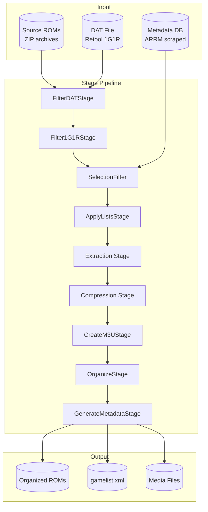

### Stage Base Class

All stages inherit from the `Stage` abstract base class:

```python
class Stage(ABC):
    def __init__(self, name: str):
        self.name = name
    
    @abstractmethod
    def execute(self, context: StageContext) -> StageResult:
        """Execute the stage and return results."""
        pass
    
    def should_skip(self, context: StageContext) -> bool:
        """Check if stage should be skipped."""
        return False
```

### Stage Result

Each stage returns a `StageResult` with execution details:

| Field | Type | Description |
|-------|------|-------------|
| `status` | StageStatus | SUCCESS, FAILED, SKIPPED, PENDING |
| `message` | str | Human-readable summary |
| `files_processed` | int | Files handled by stage |
| `files_matched` | int | Files passing stage criteria |
| `files_failed` | int | Files that failed processing |
| `duration_seconds` | float | Execution time |
| `error` | Exception | Error if failed |
| `details` | Dict | Stage-specific data |

---

## 2. Stage Context & Data Flow

### StageContext Structure

The `StageContext` is the primary data structure flowing through the pipeline:

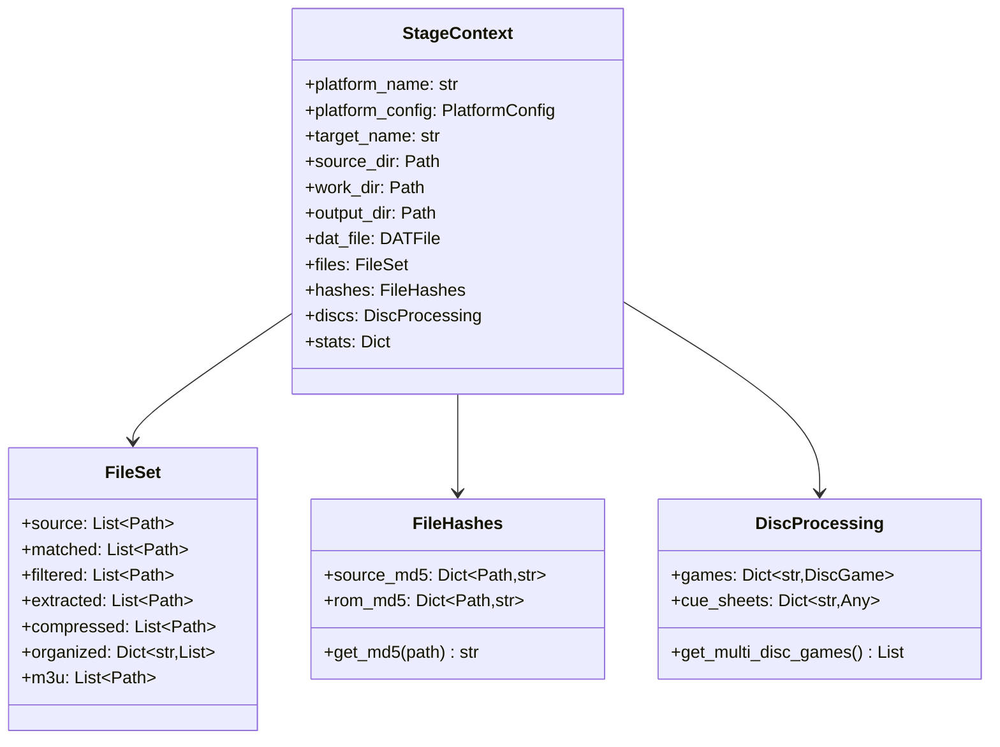

### Data Flow Through Pipeline

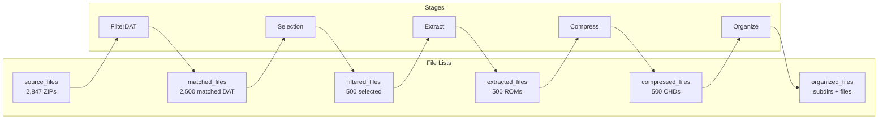

---

## 3. Filtering Stages

### FilterDATStage

Matches source ZIP files against a Retool DAT file using MD5 hashes.

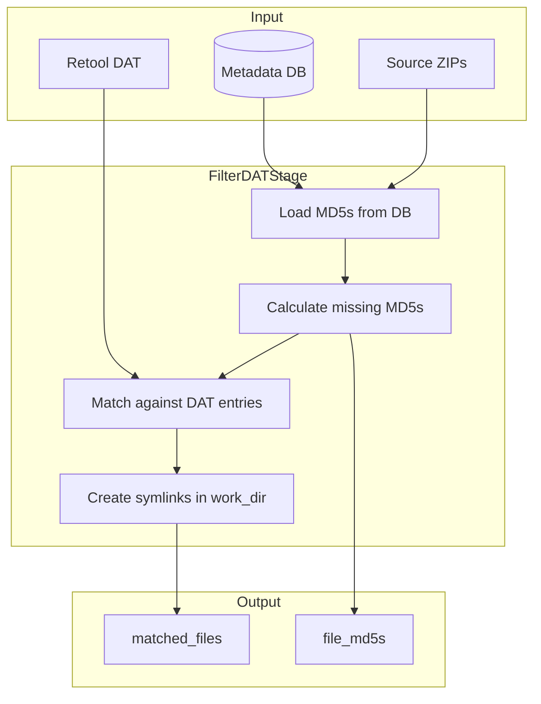

**Key features:**
- Loads pre-computed MD5s from ARRM database (fast)
- Falls back to calculating MD5s (slow but accurate)
- For ZIPs: extracts and hashes the ROM content, not the ZIP
- Creates symlinks in work_dir to avoid copying data

### Filter1G1RStage

Applies 1G1R (One Game One ROM) filtering when no DAT file is available.

| Feature | Behavior |
|---------|----------|
| Region priority | USA > World > Europe > Japan |
| Revision preference | Latest revision preferred |
| Language preference | English preferred |
| Clone handling | Keep parent, remove clones |

### SelectionFilter

Applies selection strategies to reduce ROM count based on quality, size, or testing needs.

**Strategies:**

| Strategy | Description | Use Case |
|----------|-------------|----------|
| `RATING_BUDGET` | Best-rated games within size budget | Production builds |
| `FIRST` | First N files alphabetically | Testing (A-D games) |
| `LAST` | Last N files alphabetically | Testing (W-Z games) |
| `RANDOM` | Random N files with seed | Reproducible testing |
| `SMALLEST` | N smallest files | Quick testing |
| `LARGEST` | N largest files | Stress testing |
| `ALPHABETICAL` | First N sorted | Predictable subset |

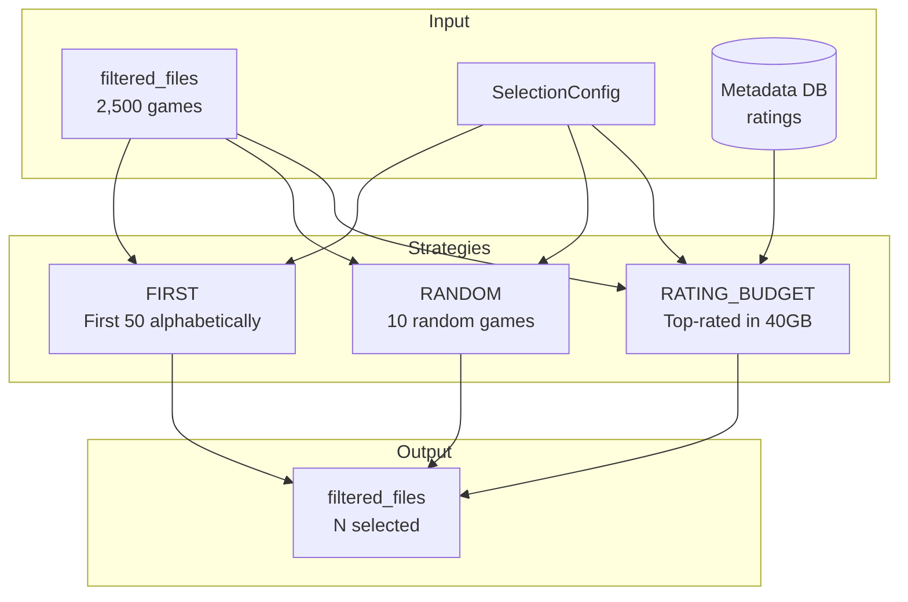

---

## 4. Extraction Stages

The system uses different extraction stages based on platform type:

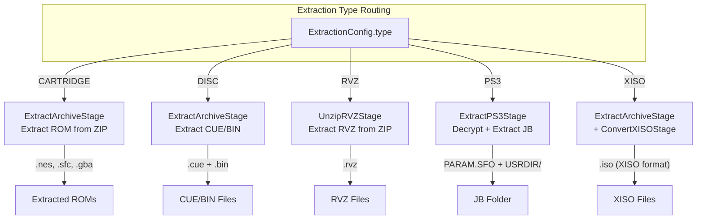

### ExtractArchiveStage

Handles both cartridge and disc extraction:

**Cartridge Mode:**
1. Extract ROM file from ZIP
2. Calculate MD5 of extracted ROM
3. Store MD5 for metadata matching
4. Set timestamp to No-Intro standard (1996-12-24 23:32:00)

**Disc Mode:**
1. Extract CUE/BIN files from ZIP
2. Parse CUE sheet for metadata
3. Detect multi-disc games (Disc 1, Disc 2, etc.)
4. Group discs by base game name

### UnzipRVZStage

For Wii/GameCube games in Dolphin's native RVZ format:

```
Input:  Game (USA).zip → contains Game (USA).rvz
Output: work_dir/Game (USA).rvz (no conversion needed!)
```

**Why RVZ?**
- Dolphin's native compressed format
- Uses zstd compression
- No conversion needed - use directly!
- Better compression than ISO

### ExtractPS3Stage

Complex pipeline for PS3 games:

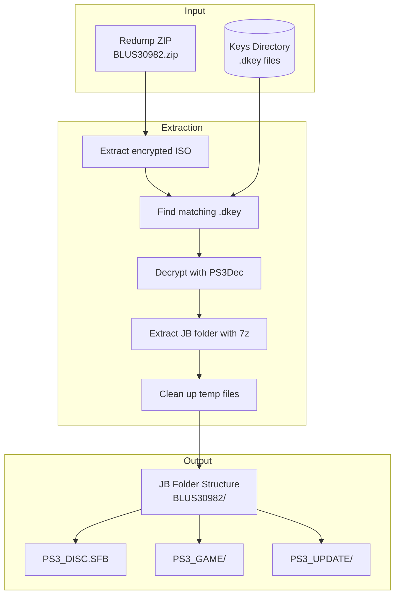

### ConvertXISOStage

For Xbox/Xbox 360 Redump images:

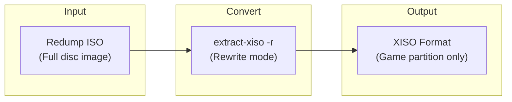

**Why convert?**
- Redump contains full disc image with padding
- xemu requires XISO format (game partition only)
- XISO is typically 20-40% smaller

---

## 5. Compression Stages

### CompressCHDStage

Converts disc images to MAME's CHD format:

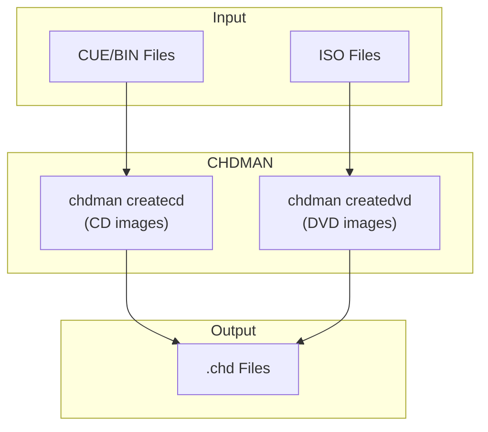

**CHD benefits:**
- Lossless compression (30-70% size reduction)
- Single file per disc (no CUE+BIN pairs)
- Widely supported by emulators
- Includes integrity verification

**Transformation recording:**
- Records original MD5 → CHD MD5 mapping
- Enables ScreenScraper lookup using original hash

### CompressArchiveStage

Compresses cartridge ROMs to archive formats:

| Format | Tool | Compression | Use Case |
|--------|------|-------------|----------|
| 7z | 7z | LZMA2 (highest) | Maximum compression |
| ZIP | zip | Deflate | Wide compatibility |
| NONE | - | Raw files | No compression |

**Standard timestamp:**
- All archived files use 1996-12-24 23:32:00 UTC
- Enables reproducible/deterministic builds
- Matches No-Intro/TOSEC standards

### CompressSquashfsStage

For Xbox games requiring squashfs format:

```
Input:  Game.iso (XISO format)
Output: Game.squashfs (compressed filesystem)
```

Used when target device requires squashfs (some ARM devices).

---

## 6. Organization Stages

### CreateM3UStage

Creates M3U playlists for multi-disc games:

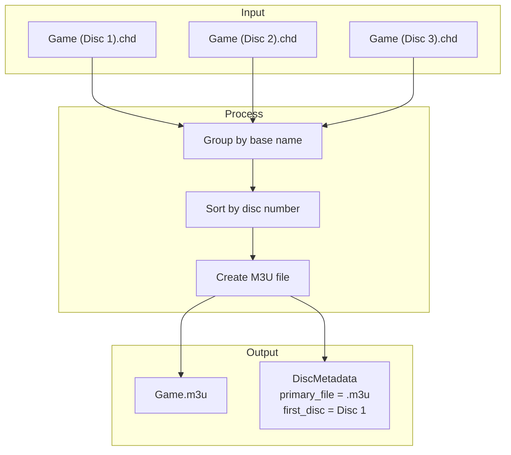

**M3U file content:**
```
Game (Disc 1).chd
Game (Disc 2).chd
Game (Disc 3).chd
```

**Metadata output:**
- `primary_file`: M3U path (used in gamelist.xml)
- `first_disc_path`: Disc 1 CHD (for metadata lookup)
- `needs_m3u`: True for multi-disc games

### OrganizeStage

Organizes ROMs into target-specific structures:

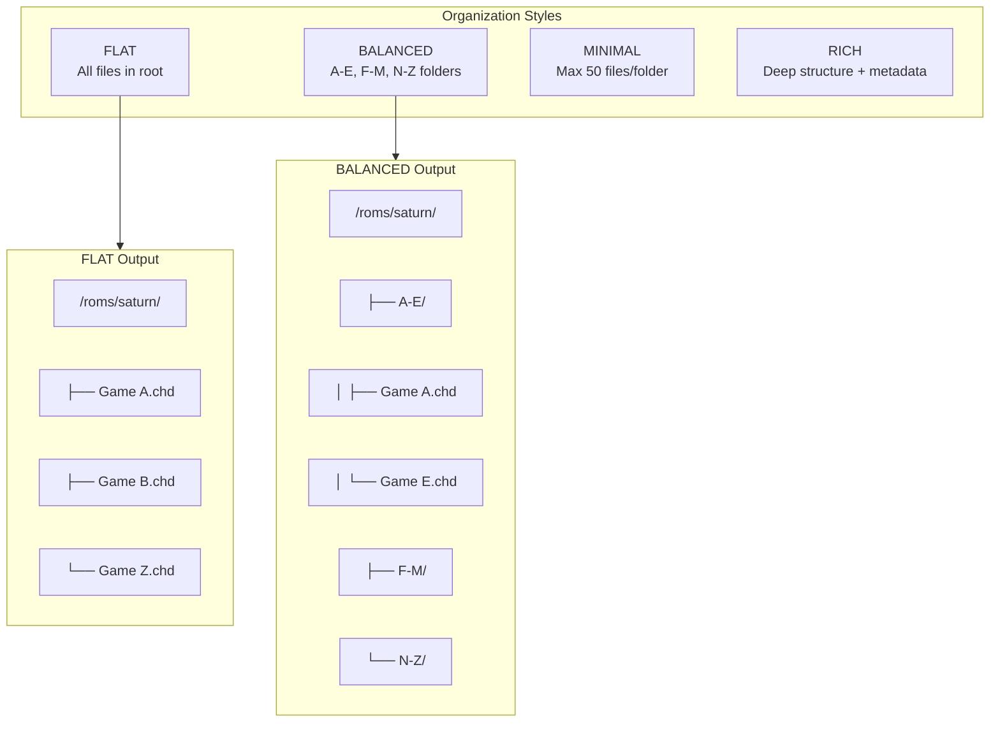

**Organization styles:**

| Style | Structure | Target |
|-------|-----------|--------|
| FLAT | All files in one directory | Batocera, general |
| BALANCED | Alphabetical groups (A-E, F-M, N-Z) | Large collections |
| MINIMAL | Max N files per folder | Everdrive/flash carts |
| RICH | Deep metadata structure | EmulationStation |

### GenerateMetadataStage

Creates gamelist.xml for EmulationStation/Batocera:

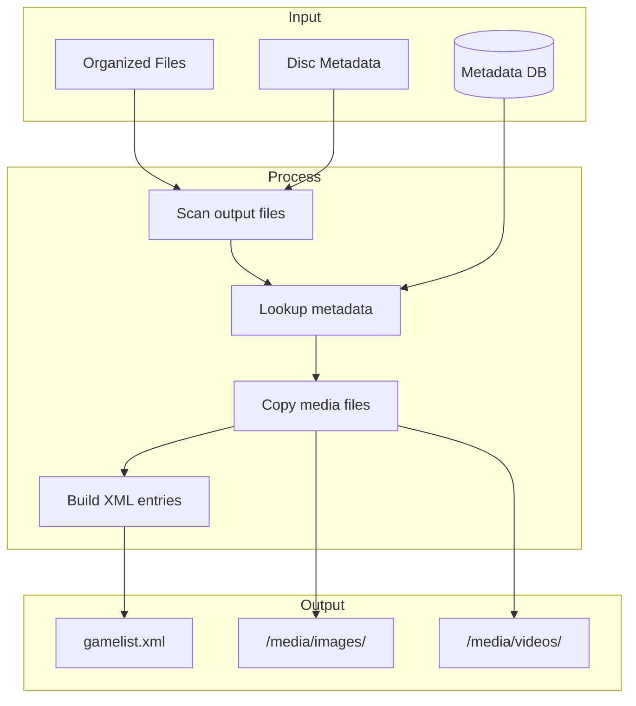

**Multi-disc handling:**
- Shows M3U file in gamelist (playable)
- Hides individual CHDs (hidden="true")
- Uses Disc 1 metadata for title/image

**Media directory structure:**
```
/roms/saturn/
├── gamelist.xml
├── media/
│   ├── images/
│   │   ├── Game A-image.png
│   │   └── Game B-image.png
│   ├── videos/
│   ├── marquees/
│   ├── thumbnails/
│   ├── wheels/
│   └── manuals/
├── Game A.chd
└── Game B.m3u
```

---

## 7. Platform-Specific Pipelines

Different platforms require different stage combinations:

### Cartridge Systems (NES, SNES, GB, GBA)

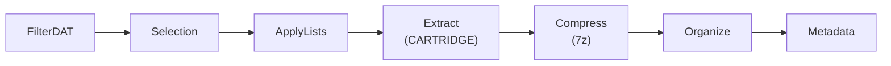

**Output:** `Game (USA).7z` containing `Game (USA).sfc`

### Disc Systems (Saturn, PSX, SegaCD)

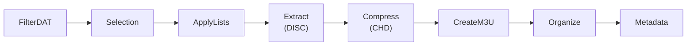

**Output:** `Game (USA).chd` or `Game (USA).m3u` + multiple CHDs

### Nintendo Disc (GameCube, Wii)

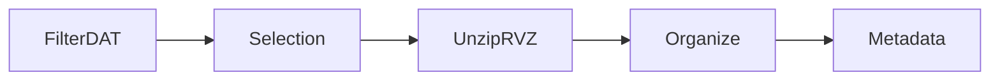

**Output:** `Game (USA).rvz` (no compression stage needed!)

### Xbox/Xbox 360

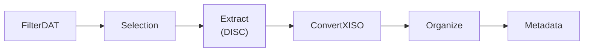

**Output:** `Game (USA).iso` (XISO format)

### PlayStation 3

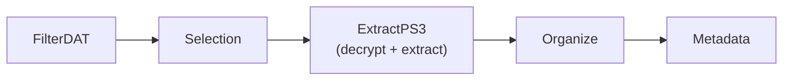

**Output:** `BLUS30982/` folder with JB structure

---

## 8. Selection Strategies

### Rating Budget Strategy

The most sophisticated selection strategy for production builds:

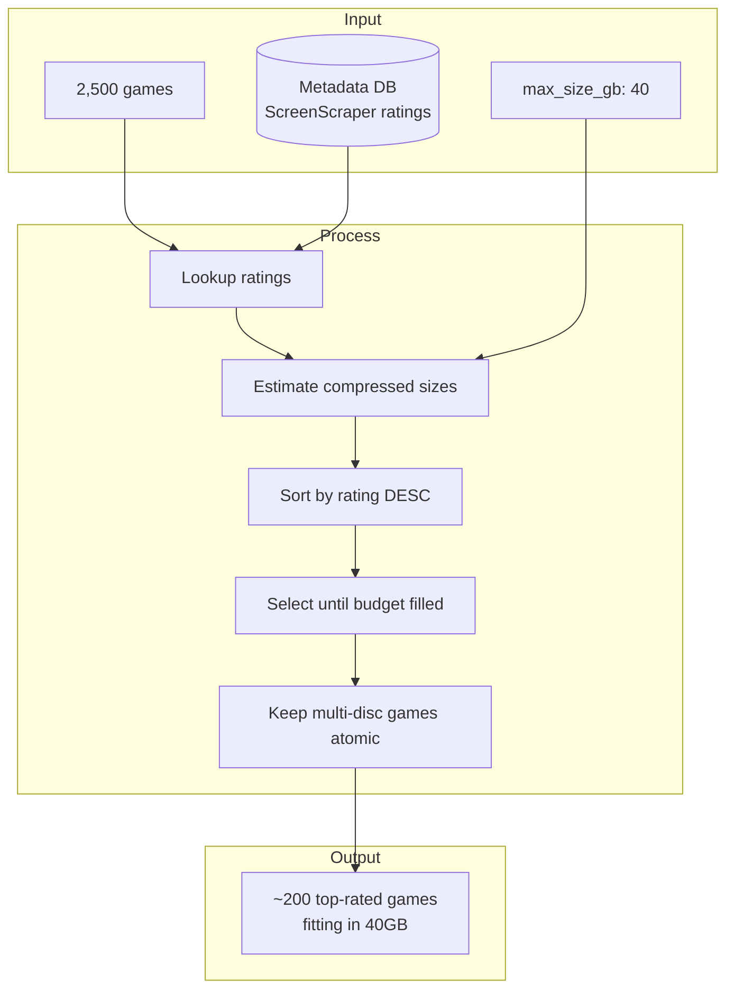

**Compression ratio estimation:**

The system uses historical compression ratios to estimate final sizes:

| Platform | Default Ratio | Actual (learned) |
|----------|--------------|------------------|
| Saturn | 0.65 | 0.58-0.72 |
| PSX | 0.70 | 0.65-0.75 |
| PS2 | 0.75 | 0.70-0.80 |
| Dreamcast | 0.68 | 0.60-0.75 |
| GameCube | 0.72 | 0.65-0.78 |

### Test Mode Strategies

For quick testing without processing entire libraries:

```yaml
# First 10 games alphabetically
selection:
  strategy: first
  limit: 10

# Random 10 games (reproducible)
selection:
  strategy: random
  limit: 10
  seed: 42

# 5% of collection starting at 50%
selection:
  strategy: first
  percentage: 5
  offset: 50  # Start at M-N games
```

---

## 9. List System

### ApplyListsStage

Provides fine-grained control over ROM selection:

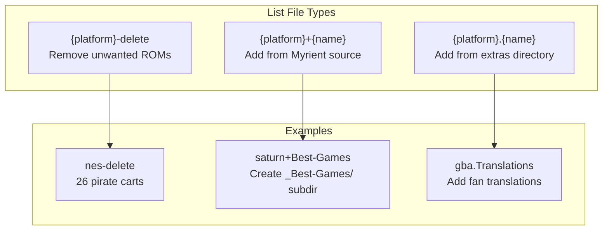

### List File Format

Plain text, one game per line (partial matching):

```
# saturn+Best-Games
Panzer Dragoon Saga
Radiant Silvergun
Guardian Heroes
Dragon Force
Shining Force III
```

### Subdirectory Creation

Lists create organized subdirectories:

```
/roms/saturn/
├── gamelist.xml
├── _Best-Games/
│   ├── Panzer Dragoon Saga.chd
│   └── Radiant Silvergun.chd
├── _Translations/
│   └── Lunar - Silver Star Story.chd
├── Game A.chd
└── Game B.chd
```

**Subdirectory behavior:**

| List Type | Operation | Example |
|-----------|-----------|---------|
| `+` (Myrient) | COPY transformed files | Source flows through pipeline |
| `.` (Extra) | MOVE pre-transformed files | Already in final format |

---

## Summary

ROM Farmer's transformation system provides:

| Capability | Implementation |
|------------|----------------|
| **Flexible filtering** | DAT matching, 1G1R, selection strategies |
| **Multi-format extraction** | Cartridge, disc, RVZ, PS3, XISO |
| **Optimal compression** | CHD for disc, 7z for cartridge, RVZ passthrough |
| **Multi-disc support** | M3U playlists with atomic selection |
| **Frontend integration** | gamelist.xml with media files |
| **Quality selection** | Rating-based budgeting |
| **List-based curation** | Delete, add, organize into subdirs |

The pipeline architecture enables ROM Farmer to process collections from source archives to fully-organized, metadata-rich output directories ready for any emulation frontend.
